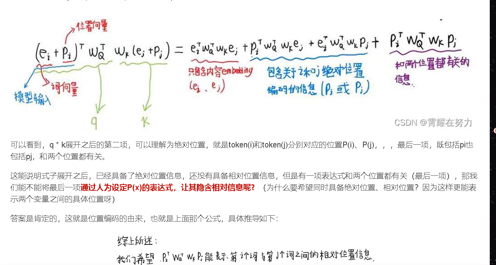

## [位置编码blog](https://blog.csdn.net/m0_59113542/article/details/129261342)

好的，下面通过一个具体的例子详细解释 Byte-level BPE (BBPE) 的工作原理，以及它如何改进传统 BPE 方法。

### 示例

假设我们有一个简单的文本：
```
文本: "hello 你好"
```

### 传统 BPE

1. **字符级别的 token**：
   - 首先，将每个字符作为一个基本的 token。对于英文字符，这样做没有问题，但对于中文字符，每个字符也需要作为一个独立的 token。
   - 初始词汇表：`{'h', 'e', 'l', 'o', ' ', '你', '好'}`

2. **合并最频繁的字符对**：
   - 例如，在合并 `h` 和 `e` 后，我们得到一个新的 token `he`。
   - 重复这一过程，不断合并最频繁的字符对。

这种方法的问题在于，对于像中文这样的语言，每个字符都作为一个独立的 token，这会导致词汇表非常大。

### Byte-level BPE (BBPE)

BBPE 通过将字节作为基本的 token，解决了上述问题。下面是 BBPE 的详细步骤：

1. **将字符转换为字节**：
   - 每个字符用其 UTF-8 字节表示。例如：
     ```
     'h' -> [104]
     'e' -> [101]
     'l' -> [108]
     'o' -> [111]
     ' ' -> [32]
     '你' -> [228, 189, 160]
     '好' -> [229, 165, 189]
     ```

2. **初始化词汇表**：
   - 初始词汇表包含所有可能的字节（256 个），再加上一个特殊的结束 token（例如 `</w>`）。
   - 初始词汇表：`{0, 1, 2, ..., 255, '</w>'}`

3. **将文本转换为字节序列**：
   - 文本 `"hello 你好"` 转换为字节序列：
     ```
     [104, 101, 108, 108, 111, 32, 228, 189, 160, 229, 165, 189]
     ```

4. **合并最频繁的字节对**：
   - 计算字节对的频率，找到最常见的字节对。例如，假设字节对 `[104, 101]`（对应 `he`）最常见。
   - 合并 `he` 后的字节序列：
     ```
     [104101, 108, 108, 111, 32, 228, 189, 160, 229, 165, 189]
     ```
   - 重复这个过程，逐步合并最频繁的字节对。

### 举例详细说明

#### 初始状态

```
文本: "hello 你好"
字节序列: [104, 101, 108, 108, 111, 32, 228, 189, 160, 229, 165, 189]
词汇表: {0, 1, 2, ..., 255, '</w>'}
```

#### 第一步合并

假设最频繁的字节对是 `[104, 101]`（`he`）。

```
合并 'he':
新字节序列: [104101, 108, 108, 111, 32, 228, 189, 160, 229, 165, 189]
新词汇表: {0, 1, 2, ..., 255, '</w>', 104101}
```

#### 第二步合并

假设下一个最频繁的字节对是 `[108, 108]`（`ll`）。

```
合并 'll':
新字节序列: [104101, 108108, 111, 32, 228, 189, 160, 229, 165, 189]
新词汇表: {0, 1, 2, ..., 255, '</w>', 104101, 108108}
```

#### 后续合并

继续合并最频繁的字节对，直到得到理想的词汇表。

### 最终结果

经过多次合并，BBPE 方法生成的词汇表包含了高频的字节对，能够高效地表示文本，而不需要为每个字符单独建立 token。这样，对于中文、日文等复杂字符，以及表情符号等，BBPE 都能够有效处理。

### 总结

通过将字节作为基本 token，BBPE 方法避免了传统 BPE 方法中对于多字符语言（如中文）词汇表膨胀的问题，并能够高效地表示各种语言和符号。


---

似然度（Likelihood）在统计学和机器学习中是一个重要的概念，反映了模型参数在给定数据下的适合程度。在自然语言处理（NLP）中的tokenization问题中，似然度用来评估词汇表和tokenization方案的好坏。以下是似然度和其反映的信息量的详细解释：

### 1. 似然度的定义

在tokenization问题中，似然度 \( \mathbf{p}(x_{1:L}) \) 表示给定词汇表 \( \mathcal{V} \) 和tokenization \( T \) 下，生成训练数据序列 \( x_{1:L} \) 的概率。

### 2. 似然度反映的内容

#### 2.1 模型的适合度

似然度反映了当前词汇表和tokenization方案对训练数据的适合程度。较高的似然度意味着当前的词汇表和tokenization方案更能有效地描述和生成训练数据。

#### 2.2 信息量

在信息论中，信息量（Information Content）通常与负对数似然度相关。信息量表示从数据中获取的信息多少。似然度较高时，对应的信息量较低，因为数据和模型匹配较好，数据带来的“惊奇”较少。

### 3. 信息量的计算

信息量可以通过负对数似然度来计算。公式如下：

\[ I(x_{1:L}) = -\log(\mathbf{p}(x_{1:L})) \]

- 当似然度 \( \mathbf{p}(x_{1:L}) \) 较高时，信息量 \( I(x_{1:L}) \) 较低。
- 当似然度 \( \mathbf{p}(x_{1:L}) \) 较低时，信息量 \( I(x_{1:L}) \) 较高。

### 4. 例子

假设我们有两种tokenization方案 \( T_1 \) 和 \( T_2 \)，对应的似然度分别为 \( \mathbf{p}_1(x_{1:L}) \) 和 \( \mathbf{p}_2(x_{1:L}) \)。

- 如果 \( \mathbf{p}_1(x_{1:L}) = 0.8 \)，则信息量 \( I_1(x_{1:L}) = -\log(0.8) \approx 0.22 \)。
- 如果 \( \mathbf{p}_2(x_{1:L}) = 0.5 \)，则信息量 \( I_2(x_{1:L}) = -\log(0.5) \approx 0.69 \)。

从上面的计算可以看出，较高的似然度（0.8）对应较低的信息量（0.22），反映了数据和模型的匹配度较高。

### 5. 重要性评估

通过计算不同token的似然度，可以评估每个token的重要性。如果移除一个token导致似然度大幅下降，则该token对数据的描述是重要的。

### 结论

- **似然度**：反映了模型（词汇表和tokenization方案）对数据的适合度。
- **信息量**：通过负对数似然度计算，反映数据中包含的信息多少。
- **重要性评估**：通过似然度变化，评估每个token在词汇表中的重要性。

希望这个详细解释对你理解似然度和信息量的关系有所帮助。

----

计算损失函数 \( \text{loss}(x) \) 的目的是量化如果从词汇表中移除某个token \( x \)，模型的似然度会降低多少。具体步骤如下：

### 1. 概述

损失函数 \( \text{loss}(x) \) 反映了一个token \( x \) 对整个tokenization过程的重要性。计算这个损失函数的步骤主要包括以下几步：

1. 计算包含token \( x \) 的当前tokenization \( T \) 的似然度 \( \mathbf{p}(x_{1:L}) \)。
2. 移除token \( x \) 后，重新计算tokenization的似然度。
3. 通过比较这两种情况下的似然度，计算出损失函数 \( \text{loss}(x) \)。

### 2. 具体步骤

假设当前词汇表为 \( \mathcal{V} \)，tokenization为 \( T \)，训练数据为 \( \mathbf{x}_{1:L} \)。

#### 2.1 当前tokenization的似然度

计算当前tokenization的似然度 \( \mathbf{p}(x_{1:L}) \)。公式为：

\[ \mathbf{p}(x_{1:L}) = \prod_{(i,j) \in T} p(x_{i:j}) \]

其中，\( p(x_{i:j}) \) 是token \( x_{i:j} \) 的概率。

#### 2.2 移除token后的重新计算

假设我们移除词汇表中的token \( x \)，得到新的词汇表 \( \mathcal{V}' = \mathcal{V} \setminus \{x\} \)。在新的词汇表下，重新进行tokenization，得到新的tokenization \( T' \)。

计算新的tokenization的似然度 \( \mathbf{p}'(x_{1:L}) \)。公式为：

\[ \mathbf{p}'(x_{1:L}) = \prod_{(i,j) \in T'} p'(x_{i:j}) \]

其中，\( p'(x_{i:j}) \) 是新的词汇表下token \( x_{i:j} \) 的概率。

#### 2.3 损失函数计算

损失函数 \( \text{loss}(x) \) 的计算公式为：

\[ \text{loss}(x) = \mathbf{p}(x_{1:L}) - \mathbf{p}'(x_{1:L}) \]

这反映了移除token \( x \) 对似然度的影响。

### 3. 示例

假设有一个简单的训练数据 "ababc"，初始词汇表 \( \mathcal{V} = \{ab, c\} \)，tokenization \( T = \{(1,2), (3,4), (5,5)\} \)，计算似然度如下：

1. **当前tokenization的似然度**:
   - Tokenization: \(\{(1,2), (3,4), (5,5)\}\)
   - 似然度：\( \mathbf{p}(x_{1:L}) = \frac{2}{3} \cdot \frac{2}{3} \cdot \frac{1}{3} = \frac{4}{9} \)

2. **移除token 'ab' 后的似然度**:
   - 新词汇表: \( \mathcal{V}' = \{c\} \)
   - 新tokenization: 可能会是 \(\{(1,1), (2,2), (3,3), (4,4), (5,5)\}\)
   - 新的似然度：假设新似然度为 \( \mathbf{p}'(x_{1:L}) = \frac{1}{6} \)

3. **计算损失函数**:
   - \( \text{loss}(x) = \mathbf{p}(x_{1:L}) - \mathbf{p}'(x_{1:L}) = \frac{4}{9} - \frac{1}{6} \)

通过计算，可以看出移除token 'ab' 后对似然度的影响，从而判断其在词汇表中的重要性。

### 结论

通过这种方式计算每个token的损失函数，可以逐步优化词汇表，保留重要的tokens，移除不重要的tokens，提高模型的效率和准确度。

---

在这张图片中，“Pro: simple training objective (maximum likelihood)” 指的是“优点：简单的训练目标（最大似然）”。这是指在训练自回归语言模型（如GPT-2和GPT-3）时，使用最大似然估计作为其训练目标的一种优点。

### 详细解释

**最大似然估计（Maximum Likelihood Estimation, MLE）** 是一种常用的统计方法，用于估计模型参数，使得在给定参数下数据的似然度最大。在语言模型的上下文中，训练目标是通过最大化给定训练数据序列的似然度来优化模型参数。

### 具体内容

#### 1. 自回归语言模型

自回归语言模型（如GPT-2和GPT-3）是一种通过给定前面 \( x_{1:i} \) 个tokens 来预测下一个token \( x_{i+1} \) 的模型。它们通过递归地生成整个序列 \( x_{i+1:L} \)。

#### 2. 训练目标

对于自回归语言模型，训练目标是最大化给定训练数据序列的似然度。这可以通过最大似然估计来实现，具体步骤如下：

- 给定训练数据 \( x_{1:L} \)，计算每个token \( x_{i} \) 的条件概率 \( p(x_{i} \mid x_{1:i-1}) \)。
- 最大化整个序列的联合概率 \( p(x_{1:L}) \)，它可以分解为条件概率的乘积：

\[ p(x_{1:L}) = \prod_{i=1}^{L} p(x_{i} \mid x_{1:i-1}) \]

#### 3. 简单的训练目标

使用最大似然估计作为训练目标有以下几个优点：

- **明确的目标**：训练目标非常明确，就是最大化给定数据的似然度。
- **易于计算**：条件概率的计算相对简单，可以通过标准的梯度下降方法来优化。
- **有效性**：最大似然估计方法在很多实际应用中效果很好，能够有效地训练出高质量的语言模型。

### 结论

在图片中提到的“Pro: simple training objective (maximum likelihood)”强调了自回归语言模型训练的一个主要优点：使用最大似然估计作为训练目标，使得训练过程明确、简单且有效。这是自回归语言模型的一大优势，也是其成功的原因之一。

---

该图片详细介绍了编码器-解码器（Encoder-Decoder）模型的特点，优点和缺点。以下是对图片内容的详细解释：

### 编码器-解码器模型

编码器-解码器模型（如BERT、T5等）结合了编码器和解码器的优点，可以对输入进行双向上下文嵌入，并生成输出。这类模型既能理解整个输入序列，又能生成所需的输出。

### 主要内容

#### 模型的工作方式

给定输入序列 \( x_{1:L} \)，模型生成输出序列 \( y_{1:L} \)。这个过程可以用以下公式表示：

\[ x_{1:L} \Rightarrow \phi(x_{1:L}), p(y_{1:L} \mid \phi(x_{1:L})) \]

其中， \( \phi(x_{1:L}) \) 是输入序列的上下文嵌入，\( p(y_{1:L} \mid \phi(x_{1:L})) \) 是在上下文嵌入基础上生成输出的概率分布。

#### 示例

图片中的示例是表格到文本生成（table-to-text generation）：

- 输入: \([ \text{name: Clowns}, \text{eatType: coffee shop} ]\)
- 输出: \([ \text{Clowns is a coffee shop} ]\)

这个示例展示了模型如何将结构化数据转化为自然语言文本。

### 优点和缺点

#### 优点

1. **双向上下文嵌入（Bidirectional Contextual Embeddings）**:
   - 编码器-解码器模型能够同时利用左侧和右侧的上下文信息进行嵌入。
   - 例如，对于token \( x_i \)，其嵌入可以依赖于左侧上下文 \( x_{1:i-1} \) 和右侧上下文 \( x_{i+1:L} \)。

2. **自然生成输出（Naturally Generate Outputs）**:
   - 这种模型能够自然地生成输出序列，适用于文本生成任务。

#### 缺点

1. **更多的特定训练目标（Ad-Hoc Training Objectives）**:
   - 编码器-解码器模型通常需要设计更多特定的训练目标，以便适应不同的任务。
   - 例如，对于不同类型的生成任务（如摘要生成、翻译、表格到文本生成等），需要设计不同的损失函数和训练策略。

### 总结

编码器-解码器模型结合了编码器和解码器的优点，能够利用双向上下文信息进行嵌入，并自然地生成输出。这使得它们在各种文本生成任务中表现优异。然而，由于需要为不同任务设计特定的训练目标，这也增加了训练的复杂性。

希望这个详细解释能够帮助你更好地理解图片内容及编码器-解码器模型的工作原理、优点和缺点。

----

这张图片详细介绍了encoder-only模型（如BERT和RoBERTa）的特性、优点和缺点，并给出了示例。

### 详细解释图片内容

#### Encoder-only模型

Encoder-only模型（如BERT、RoBERTa）是一种只使用编码器（encoder）结构的语言模型。它们主要用于生成上下文嵌入（contextual embeddings），这些嵌入通常用于分类任务或自然语言理解任务。

- **公式**:
  \[
  x_{1:L} \Rightarrow \phi(x_{1:L})
  \]
  这里的 \( \phi(x_{1:L}) \) 表示输入序列 \( x_{1:L} \) 的上下文嵌入。

#### 使用示例

- **情感分类（Sentiment Classification）**:
  - 例子: `[CLS], the, movie, was, great`
  - 输出: `positive`
  
- **自然语言推理（Natural Language Inference）**:
  - 例子: `[CLS], all, animals, breathe, [SEP], cats, breathe`
  - 输出: `entailment`

#### 优点（Pro）

- **双向上下文依赖（Bidirectional Context Dependency）**:
  - 对于每个token \( x_i \)，其上下文嵌入可以同时依赖于左侧上下文 \( x_{1:i-1} \) 和右侧上下文 \( x_{i+1:L} \)。这种双向依赖性可以捕捉到更多的信息，提高模型的理解能力。

#### 缺点（Con）

- **无法自然生成文本（Cannot Naturally Generate Completions）**:
  - 由于encoder-only模型主要用于生成上下文嵌入，而不是生成序列，因此它们不能像自回归模型（如GPT-2、GPT-3）那样自然地生成文本。

- **需要更多特设的训练目标（Requires More Ad-hoc Training Objectives）**:
  - 例如，掩码语言建模（Masked Language Modeling, MLM）是BERT的主要训练目标。MLM任务要求模型预测被随机掩码掉的token，这不同于自回归模型的标准最大似然估计（MLE）训练目标。MLM的训练目标更加复杂，需要设计特定的掩码策略，并在训练过程中动态调整。

### 结论

- **优点**: Encoder-only模型通过双向上下文依赖性，能够捕捉更多的信息，提高对文本的理解能力。
- **缺点**: 它们不能自然生成文本，并且需要设计和实现更复杂的特设训练目标（如掩码语言建模），增加了训练过程的复杂性。

希望这个详细解释对你理解图片内容和它的缺点有所帮助！


---
这张图片详细解释了将token序列转换为向量序列的过程，并介绍了如何进一步处理这些向量以获得上下文嵌入。

### 1. 初步步骤（Preliminaries）

#### 转换token序列为向量序列

- **EmbedToken函数**:
  - 定义: `def EmbedToken(x_{1:L} : \mathcal{V}^L) \rightarrow \mathbb{R}^{d \times L}`
  - 功能: 将token序列 \( x_{1:L} \) 中的每个token \( x_i \) 转换为一个向量。
  - 过程:
    - 通过查找嵌入矩阵 \( E \in \mathbb{R}^{|\mathcal{V}| \times d} \)（从数据中学习得到的参数）将每个token \( x_i \) 转换为向量。
    - 返回结果是向量序列 \( [E_{x_1}, \ldots, E_{x_L}] \)。
  - 示例:
    - 输入: `["the", "mouse", "ate", "the", "cheese"]`
    - 输出: 对应的向量序列。

这些向量就是早期的（上下文无关的）词嵌入。

#### 2. 抽象的SequenceModel函数

- **SequenceModel函数**:
  - 定义: `def SequenceModel(x_{1:L} : \mathbb{R}^{d \times L}) \rightarrow \mathbb{R}^{d \times L}`
  - 功能: 处理序列 \( x_{1:L} \) 中的每个元素 \( x_i \)，并将上下文无关的嵌入转换为上下文相关的嵌入。
  - 过程:
    - 处理序列 \( x_{1:L} \) 中的每个元素 \( x_i \)，使其考虑其他元素的上下文。
    - 这可以通过不同的方法实现，例如FeedForwardSequenceModel（前馈序列模型）、SequenceRNN（序列循环神经网络）、TransformerBlock（Transformer块）等。

#### 3. 序列模型的简化形式

- 最简单的序列模型基于前馈网络（Feedforward Networks）:
  - 参考: Bengio et al., 2003
  - 应用于固定长度上下文，与n-gram模型类似。

### 结论

这张图片介绍了将token序列转换为向量序列，并进一步处理这些向量以获得上下文相关嵌入的基本过程。通过嵌入矩阵将token转换为向量后，再使用不同的序列模型方法处理这些向量，使其能够捕捉上下文信息。这些步骤是许多自然语言处理任务的基础。

希望这个详细解释对你理解图片内容有所帮助！





---

归一化（Normalization）是深度学习中一种常见的技术，旨在提高训练的稳定性和模型的性能。在Transformer模型中，归一化方法分为前归一化（Pre-Norm）和后归一化（Post-Norm）。它们的区别主要在于归一化操作在子层计算中的位置。以下是详细解释：

### 后归一化（Post-Norm）

**原始Transformer论文中提出的方法**：
- **位置**：在所有子层计算之后进行归一化。
- **流程**：
  1. 对输入进行子层计算（如自注意力或前馈神经网络）。
  2. 将子层计算的输出进行层归一化。
  3. 加上残差连接的输入。
  
- **公式**：
  \[
  \text{Output} = \text{LayerNorm}(x + \text{SubLayer}(x))
  \]

**优点**：
- 简单直接，容易理解和实现。
- 在初始训练阶段，模型更容易聚焦于主要的子层计算。

**缺点**：
- 可能导致梯度消失或爆炸问题，因为归一化操作在残差连接之后进行，对训练的稳定性有一定影响。

### 前归一化（Pre-Norm）

**GPT-2中使用的方法**：
- **位置**：在所有子层计算之前进行归一化。
- **流程**：
  1. 对输入进行层归一化。
  2. 将归一化的输出进行子层计算（如自注意力或前馈神经网络）。
  3. 加上残差连接的输入。

- **公式**：
  \[
  \text{Output} = x + \text{SubLayer}(\text{LayerNorm}(x))
  \]

**优点**：
- 提高了训练的稳定性，因为归一化操作在残差连接之前进行，有助于控制梯度的规模。
- 减少了梯度消失或爆炸的风险。

**缺点**：
- 在初始训练阶段，模型可能难以聚焦于主要的子层计算，因为输入在子层计算之前已经被归一化。

### 对比总结

- **位置**：Post-Norm在子层计算之后进行归一化，而Pre-Norm在子层计算之前进行归一化。
- **训练稳定性**：Pre-Norm提高了训练的稳定性，减少了梯度消失或爆炸的问题。Post-Norm在初始训练阶段可能更容易，但在深层网络中可能出现稳定性问题。
- **实现**：
  - **Post-Norm**：
    \[
    \text{Output} = \text{LayerNorm}(x + \text{SubLayer}(x))
    \]
  - **Pre-Norm**：
    \[
    \text{Output} = x + \text{SubLayer}(\text{LayerNorm}(x))
    \]

**参考文献**：Davis et al. 2021 提供了关于这两种归一化方法对训练稳定性影响的深入研究。

希望这个详细解释能帮助你理解前归一化和后归一化的区别及其影响。