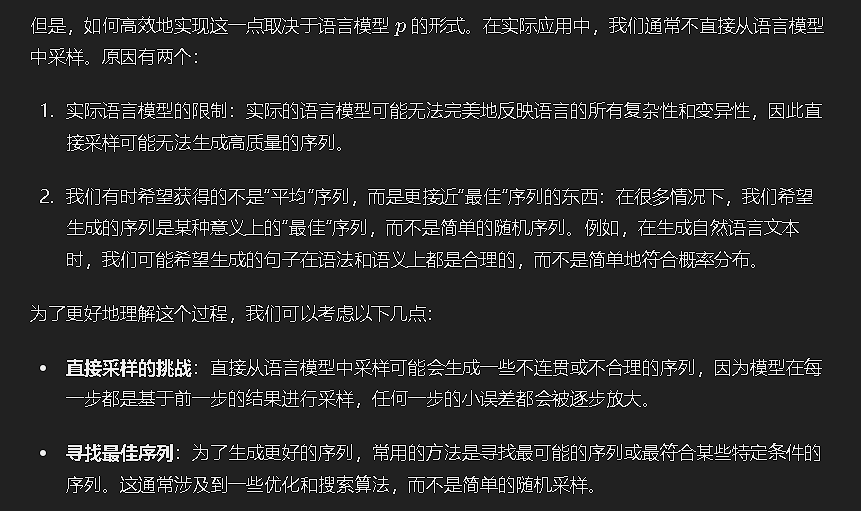
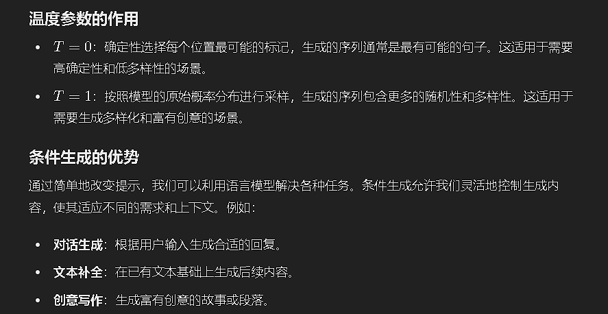
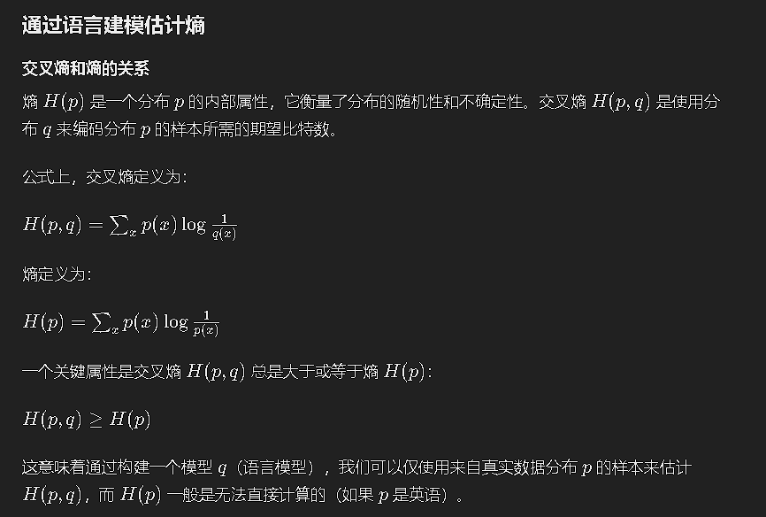
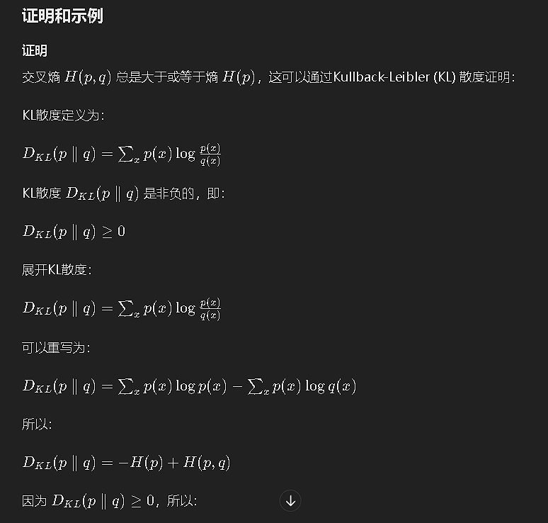
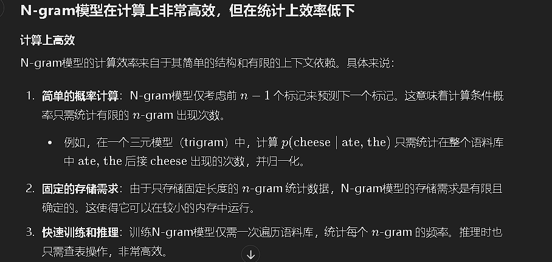

欢迎来到CS324！这是一个关于理解和开发大语言模型的新课程。

## 什么是语言模型？

### 语言模型的定义
语言模型（LM）的经典定义是一个序列的概率分布。假设我们有一个词汇表V，由一组标记组成。语言模型p为每个标记序列x1, ..., xL ∈ V分配一个概率（一个介于0和1之间的数值）：

\[ p(x1, ..., xL) \]

这个概率直观地告诉我们一个标记序列的“好坏”。例如，如果词汇表是V={ate, ball, cheese, mouse, the}，那么语言模型可能会分配如下概率（示例）：

\[ p(the, mouse, ate, the, cheese) = 0.02 \]
\[ p(the, cheese, ate, the, mouse) = 0.01 \]
\[ p(mouse, the, the, cheese, ate) = 0.0001 \]

从数学上看，语言模型是一个非常简单而美丽的对象。但这种简单性是具有欺骗性的：给所有序列分配（有意义的）概率的能力需要非凡的（但隐含的）语言能力和世界知识。

例如，语言模型应该隐含地为“mouse the the cheese ate”分配一个非常低的概率，因为它不合语法（语法知识）。语言模型应该隐含地为“the mouse ate the cheese”分配一个高于“the cheese ate the mouse”的概率，因为尽管两句话在语法上是一样的，但在语义上却有差异。

### 生成
如定义，语言模型p接受一个序列并返回一个概率以评估其好坏。我们也可以在给定语言模型的情况下生成一个序列。最纯粹的方法是从语言模型p中采样一个序列x1:L，概率等于p(x1:L)，表示为：

\[ x1:L ∼ p \]

如何高效地实现这一点取决于语言模型p的形式。在实践中，我们通常不直接从语言模型中采样，因为实际语言模型的限制和我们有时希望获得的不是“平均”序列，而是更接近“最佳”序列的东西。



## 自回归语言模型
一个常见的方法是使用概率链规则来表示一个序列x1:L的联合分布p(x1:L)：

\[ p(x1:L) = p(x1)p(x2|x1)p(x3|x1, x2)⋯p(xL|x1:L-1) = ∏_{i=1}^L p(xi|x1:i-1) \]

例如（示例）：

\[ p(the, mouse, ate, the, cheese) = p(the)p(mouse|the)p(ate|the, mouse)p(the|the, mouse, ate)p(cheese|the, mouse, ate, the) \]

特别是，p(xi|x1:i-1)是给定前面的标记x1:i-1时下一个标记xi的条件概率分布。

当然，任何联合概率分布都可以用这种方式数学地表示，但自回归语言模型是一种可以高效计算每个条件分布p(xi|x1:i-1)的方法（例如，使用前馈神经网络）。

### 生成
现在，要从自回归语言模型p生成一个完整的序列x1:L，我们可以根据到目前为止生成的标记一个接一个地采样：

\[ for \ i=1, ..., L: xi ∼ p(xi|x1:i-1)^{1/T} \]

其中，T ≥ 0是一个控制我们希望从语言模型中得到多少随机性的温度参数：

- T=0：在每个位置i确定性地选择最可能的标记xi
- T=1：从纯语言模型中“正常”采样
- T=∞：从整个词汇表V上的均匀分布中采样

然而，如果我们只是将概率提高到1/T次幂，概率分布可能不会总和为1。我们可以通过重新归一化分布来解决这个问题。我们称归一化后的版本pT(xi|x1:i-1) ∝ p(xi|x1:i-1)^{1/T}为退火条件概率分布。例如：

\[ p(cheese)=0.4, p(mouse)=0.6 \]
\[ p_{T=0.5}(cheese)=0.31, p_{T=0.5}(mouse)=0.69 \]
\[ p_{T=0.2}(cheese)=0.12, p_{T=0.2}(mouse)=0.88 \]
\[ p_{T=0}(cheese)=0, p_{T=0}(mouse)=1 \]

附注：退火是对冶金学的一个引用，其中热材料逐渐冷却，并出现在采样和优化算法如模拟退火中。

技术说明：用温度T参数应用到每个条件分布p(xi|x1:i-1)^{1/T}进行迭代采样，除非T=1，否则不等同于从长度为L的退火分布中采样。

### 条件生成
更一般地，我们可以通过指定一些前缀序列x1:i（称为提示）并采样其余的xi+1:L（称为补全）来执行条件生成。例如，使用T=0生成（示例）：

\[ the, mouse, ate \ (提示) ⇝ T=0 \ the, cheese (补全) \]

如果我们将温度改为T=1，我们可以得到更多的多样性（示例），例如its house和my homework。

正如我们很快会看到的，条件生成通过简单地改变提示，解锁了语言模型解决各种任务的能力。

### 总结
- 语言模型是一个序列x1:L的概率分布p。
- 直观上，一个好的语言模型应该具有语言能力和世界知识。
- 自回归语言模型允许在给定提示x1:i的情况下高效生成补全xi+1:L。
- 温度可以用来控制生成中的变异量。




### 简史

#### 信息论、英语的熵、n-gram模型

##### 信息论

语言模型的起源可以追溯到Claude Shannon，他在1948年发表的开创性论文《A Mathematical Theory of Communication》中创立了信息论。在这篇论文中，他引入了分布的熵：

\[ H(p) = \sum_x p(x) \log \frac{1}{p(x)} \]

熵衡量了任何算法将一个样本 \( x \sim p \) 编码（压缩）成一个比特串所需的预期比特数：

\[ the mouse ate the cheese ⇒ 0001110101 \]

熵越低，序列越“有结构”，代码长度越短。直观上，\(\log \frac{1}{p(x)}\) 是用来表示出现概率为 \( p(x) \) 的元素 \( x \) 的代码长度。如果 \( p(x) = \frac{1}{8} \)，我们应该分配 \(\log_2(8) = 3\) 比特（等效于 \(\log(8) = 2.08\) nats）。

附注：实际实现Shannon极限并非易事（例如，LDPC编码），这是编码理论的主题。

##### 英语的熵

Shannon特别感兴趣于测量英语的熵，将其表示为一个字母序列。这意味着我们设想存在一个“真实”的分布 \( p \) （尽管这种存在性是有争议的，但仍然是一个有用的数学抽象），它可以生成英语文本样本 \( x \sim p \)。

Shannon还定义了交叉熵：

\[ H(p,q) = \sum_x p(x) \log \frac{1}{q(x)} \]

它衡量了使用模型 \( q \) 的压缩方案（用长度为 \(\frac{1}{q(x)}\) 的代码表示 \( x \)）对样本 \( x \sim p \) 进行编码所需的预期比特数（nats）。

##### 通过语言建模估计熵


一个关键属性是交叉熵 \( H(p,q) \) 上界于熵 \( H(p) \)：

\[ H(p,q) \geq H(p) \]

这意味着我们可以通过构建一个模型 \( q \) （语言模型），仅使用来自真实数据分布 \( p \) 的样本来估计 \( H(p,q) \)，而 \( H(p) \) 一般是无法访问的（如果 \( p \) 是英语）。

因此，通过构建更好的模型 \( q \)，我们可以得到更好的熵 \( H(p) \) 估计，这以 \( H(p,q) \) 作为度量。

##### Shannon游戏（人类语言模型）

Shannon在1948年首次使用n-gram模型作为 \( q \)，但在他1951年的论文《Prediction and Entropy of Printed English》中，他引入了一种巧妙的方法（称为Shannon游戏），其中 \( q \) 由人类提供：

\[ the mouse ate my ho_ \]

人类不擅长提供任意文本的校准概率，因此在Shannon游戏中，人类语言模型会反复尝试猜测下一个字母，并记录猜测的次数。

#### 下游应用中的n-gram模型

语言模型首先在需要生成文本的实际应用中得到使用：

- 20世纪70年代的语音识别（输入：声学信号，输出：文本）
- 20世纪90年代的机器翻译（输入：源语言文本，输出：目标语言文本）

##### 噪声信道模型

解决这些任务的主导范式是噪声信道模型。以语音识别为例：

我们假设有一些文本从某个分布 \( p \) 中采样。
这个文本变为语音（声学信号）。
然后，给定语音，我们希望恢复（最有可能的）文本。这可以通过贝叶斯法则实现：

\[ p(\text{text} \mid \text{speech}) \propto p(\text{text})_{\text{语言模型}} \cdot p(\text{speech} \mid \text{text})_{\text{声学模型}} \]

语音识别和机器翻译系统使用词级的n-gram语言模型（Shannon首先引入了字符级n-gram模型）。

##### n-gram模型

在n-gram模型中，标记 \( x_i \) 的预测仅取决于最后的 \( n-1 \) 个字符 \( x_{i-(n-1):i-1} \)，而不是整个历史：

\[ p(x_i \mid x_{1:i-1}) = p(x_i \mid x_{i-(n-1):i-1}) \]

例如，一个三元模型（n=3）将定义：

\[ p(\text{cheese} \mid \text{the, mouse, ate, the}) = p(\text{cheese} \mid \text{ate, the}) \]

这些概率是基于大型文本语料库中各种n-gram（例如，ate the mouse 和 ate the cheese）的出现次数计算的，并适当地平滑以避免过拟合（例如，Kneser-Ney平滑）。

拟合n-gram模型到数据是非常便宜和可扩展的。因此，n-gram模型训练在海量文本上进行。例如，Brants等人在2007年为机器翻译训练了一个5-gram模型，使用了2万亿个标记。相比之下，GPT-3只训练了3000亿个标记。然而，n-gram模型在本质上是有限的。设想前缀：

 Stanford has a new course on large language models. It will be taught by    

如果n太小，模型将无法捕捉长距离依赖关系，下一词将无法依赖于Stanford。然而，如果n太大，几乎所有合理的长序列即使在“巨大”的语料库中也会出现0次，这将使得统计上难以获得良好的概率估计：

\[ \text{count(Stanford, has, a, new, course, on, large, language, models)} = 0 \]

因此，语言模型被限制在如语音识别和机器翻译等任务中，因为声学信号或源文本提供了足够的信息，仅捕捉局部依赖关系（而无法捕捉长距离依赖关系）并不是一个大问题。

### 神经语言模型

引入神经网络是语言模型的一个重要进步。Bengio 等人在2003年开创了神经语言模型，其中 \( p(x_i \mid x_{i-(n-1):i-1}) \) 由一个神经网络给出：

\[ p(\text{cheese} \mid \text{ate, the}) = \text{some-neural-network}(\text{ate, the, cheese}) \]

注意，上下文长度仍然受限于 \( n \)，但现在在统计上可以估算更大值的 \( n \) 的神经语言模型。

现在，主要的挑战是训练神经网络在计算上非常昂贵。他们在仅有1400万个单词的数据上训练了一个模型，并显示出它的性能优于在相同数据量上训练的 n-gram 模型。但由于 n-gram 模型更具可扩展性，数据不是瓶颈，n-gram 模型在接下来的十年中继续占据主导地位。

自2003年以来，神经语言建模中有两个其他关键发展包括：

- **循环神经网络（RNNs）**，包括长短期记忆网络（LSTMs），允许标记 \( x_i \) 的条件分布依赖于整个上下文 \( x_{1:i-1} \)（有效地 \( n = \infty \)），但这些模型难以训练。
- **变压器（Transformers）** 是一种较新的架构（在2017年为机器翻译开发），它再次回到具有固定上下文长度 \( n \) 的模型，但更易于训练（并利用了 GPU 的并行计算）。此外，对于许多应用，\( n \) 可以变得“足够大”（GPT-3 使用 \( n = 2048 \)）。

### 课程总结

我们将在课程的后期深入探讨架构和训练。

#### 总结

- 语言模型最初在信息论的背景下被研究，并可用于估算英语的熵。
- N-gram模型在计算上非常高效，但在统计上效率低下。
- N-gram模型在与其他模型（如语音识别的声学模型或机器翻译的翻译模型）结合使用时，对于短上下文长度非常有用。
- 神经语言模型在统计上效率高，但在计算上效率低。
- 随着时间的推移，训练大型神经网络变得足够可行，使得神经语言模型成为主导范式。

---
### 上下文学习（In-context learning）

#### 定义和示例

**上下文学习**是指在给定一组输入/输出对作为示例的情况下，语言模型能够理解并执行相似的任务，而无需额外的训练。这种学习方式仅通过提示（prompt）来实现，示例如下：

```
Input: Where is Stanford University?
Output: Stanford University is in California.
```

在这个示例中，GPT-3 给出了一个完整的句子回答，但可能并不是最信息丰富的答案。

#### 更复杂的示例

为了使模型更好地理解任务，我们可以提供更多的示例来显示输入/输出对的预期格式。例如：

```
Input: Where is MIT?
Output: Cambridge

Input: Where is University of Washington?
Output: Seattle

Input: Where is Stanford University?
Output: Stanford
```

通过这些示例，GPT-3 可以更好地理解任务并提供更简洁的答案。

#### 与监督学习的关系

在传统的**监督学习**中，我们通常有一个输入-输出对的数据集，并通过训练模型（例如，通过梯度下降的神经网络）来拟合这些示例。每次训练运行都会生成一个不同的模型。

但是，在**上下文学习**中，只有一个语言模型，通过提示（prompts）可以执行各种不同的任务。这种方式无需针对每个新任务进行单独的模型训练，只需提供几个示例，模型就可以理解并执行任务。

### 上下文学习的强大之处

上下文学习的强大之处在于其灵活性和广泛适用性：

1. **灵活性**：上下文学习不需要针对每个任务进行单独的模型训练。只需提供几个示例，模型就可以理解并执行新的任务。
2. **广泛适用性**：通过提示，语言模型可以解决多种任务，包括问答、文本生成、翻译等。这种能力远远超出了传统监督学习的范围。
3. **节省时间和资源**：上下文学习避免了繁重的模型训练过程，节省了大量的时间和计算资源。
4. **适应性强**：模型能够根据不同的提示快速调整并适应新任务，这种适应性使得它在实际应用中非常有用。

#### 示例进一步说明

例如，在传统的监督学习中，如果我们希望模型能够回答关于不同大学所在地的问题，我们需要一个包含大量大学和其所在地的数据集，然后训练模型。

然而，通过上下文学习，我们只需提供几个示例，模型就可以理解并回答类似的问题：

```
Input: Where is MIT?
Output: Cambridge

Input: Where is University of Washington?
Output: Seattle

Input: Where is Stanford University?
Output: Stanford
```

通过这些示例，模型已经学会了如何回答关于大学所在地的问题。

### 总结

上下文学习的强大之处在于它能够在不进行额外训练的情况下，通过少量的示例理解和执行新任务。这种方法大大提高了语言模型的灵活性和适应性，使其能够广泛应用于各种任务，而无需为每个任务单独训练模型。这种能力使得上下文学习成为一种非常强大的技术。