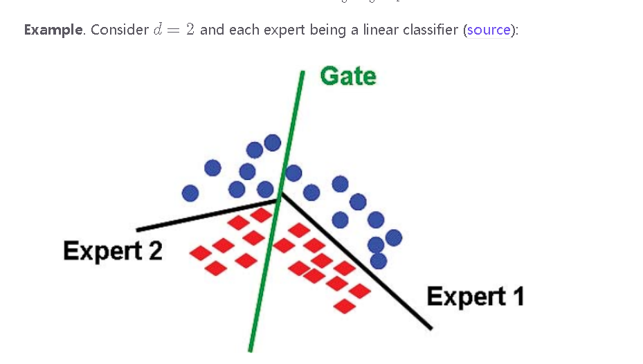

常见大型语言模型（Large Language Models, LLMs）的参数信息通常涉及模型大小（以参数数量衡量）、训练数据量和架构等方面。以下是一些知名LLM的参数信息：

### OpenAI GPT 系列
1. **GPT-2**:
   - 参数数量：1.5亿 (small)、7.7亿 (medium)、15亿 (large)
   - 训练数据量：数百亿个词
   - 架构：基于Transformer的架构，12-48层

2. **GPT-3**:
   - 参数数量：1.75千亿
   - 训练数据量：570GB文本数据
   - 架构：96层，2048维隐藏层，128个注意力头

### Google BERT 系列
1. **BERT Base**:
   - 参数数量：1.1亿
   - 训练数据量：Wikipedia和BookCorpus数据
   - 架构：12层，768维隐藏层，12个注意力头

2. **BERT Large**:
   - 参数数量：3.4亿
   - 训练数据量：同上
   - 架构：24层，1024维隐藏层，16个注意力头

### Google T5 系列
1. **T5 Small**:
   - 参数数量：6000万
   - 训练数据量：Colossal Clean Crawled Corpus (C4)
   - 架构：6层，512维隐藏层，8个注意力头

2. **T5 Base**:
   - 参数数量：2.2亿
   - 训练数据量：同上
   - 架构：12层，768维隐藏层，12个注意力头

3. **T5 Large**:
   - 参数数量：7.7亿
   - 训练数据量：同上
   - 架构：24层，1024维隐藏层，16个注意力头

4. **T5 3B**:
   - 参数数量：30亿
   - 训练数据量：同上
   - 架构：24层，2048维隐藏层，32个注意力头

5. **T5 11B**:
   - 参数数量：110亿
   - 训练数据量：同上
   - 架构：24层，4096维隐藏层，64个注意力头

### Facebook AI (Meta AI) LLaMA 系列
1. **LLaMA 7B**:
   - 参数数量：70亿
   - 训练数据量：2万亿个词
   - 架构：32层，4096维隐藏层，32个注意力头

2. **LLaMA 13B**:
   - 参数数量：130亿
   - 训练数据量：同上
   - 架构：40层，5120维隐藏层，40个注意力头

3. **LLaMA 30B**:
   - 参数数量：300亿
   - 训练数据量：同上
   - 架构：60层，6656维隐藏层，52个注意力头

4. **LLaMA 65B**:
   - 参数数量：650亿
   - 训练数据量：同上
   - 架构：80层，8192维隐藏层，64个注意力头

### Microsoft Megatron-Turing NLG
1. **Megatron-Turing NLG 530B**:
   - 参数数量：5300亿
   - 训练数据量：包含多个大型公开和专有数据集
   - 架构：基于Transformer的架构，105层，15360维隐藏层，128个注意力头

### 总结
这些大型语言模型在参数数量、训练数据量和架构设计上存在显著差异，适用于不同的自然语言处理任务。从小型模型（如T5 Small）到超大规模模型（如GPT-3和Megatron-Turing NLG 530B），它们各自有不同的优势和应用场景。选择适当的模型取决于具体任务的需求、计算资源和性能要求。

---

这张图片是对专家混合（Mixture of Experts，MoE）方法的详细解释，分为几个部分，介绍了该方法的基本概念和具体实现步骤。以下是详细解释及一个简单例子：

### 1. 单层神经网络：
我们从一个单层神经网络（ReLU激活函数）开始学习：
\[ h_{\theta}(x) = W_2 \max(W_1 x, 0) \]
- 其中参数为：\(\theta = (W_1, W_2)\)。
- 这种简单的网络可能无法表示复杂的目标函数，我们可以通过加宽或加深神经网络来改进。

### 2. 专家混合方法：
为了提高模型的表达能力，我们引入专家混合方法，包括以下几个步骤：

#### 定义多个专家（E个）：
- 每个专家有一个嵌入向量 \(w_e \in \mathbb{R}^d\) 。

#### 定义门控函数（gating function）：
门控函数 \(g_e(x)\) 表示每个专家的权重，定义为一个概率分布：
\[ g_e(x) = \frac{\exp(w_e \cdot x)}{\sum_{e'=1}^{E} \exp(w_{e'} \cdot x)} \]

#### 定义每个专家的参数：
每个专家有其特定的参数：
\[ \theta^{(e)} = (W_1^{(e)}, W_2^{(e)}) \]

#### 定义每个专家函数：
每个专家函数的定义为：
\[ h_{\theta_e}(x) = W_2^{(e)} \max(W_1^{(e)} x, 0) \]

#### 最终函数：
最终函数是所有专家函数的加权和，权重由门控函数决定：
\[ f(x) = \sum_{e=1}^{E} g_e(x) h_{\theta_e}(x) \]

### 举例子：
假设我们有两个专家网络（E=2），并且输入数据 \(x\) 是二维的（d=2）。

1. **定义专家嵌入向量**：
   - 专家1：\( w_1 = [1, -1] \)
   - 专家2：\( w_2 = [-1, 1] \)

2. **定义门控函数**：
   - 对于给定的输入 \( x = [0.5, 0.5] \)：
   \[ g_1(x) = \frac{\exp(w_1 \cdot x)}{\exp(w_1 \cdot x) + \exp(w_2 \cdot x)} = \frac{\exp(0)}{\exp(0) + \exp(0)} = 0.5 \]
   \[ g_2(x) = \frac{\exp(w_2 \cdot x)}{\exp(w_1 \cdot x) + \exp(w_2 \cdot x)} = \frac{\exp(0)}{\exp(0) + \exp(0)} = 0.5 \]

3. **定义专家参数**：
   - 专家1：\( W_1^{(1)} = [1, 0], W_2^{(1)} = 1 \)
   - 专家2：\( W_1^{(2)} = [0, 1], W_2^{(2)} = 1 \)

4. **计算专家函数**：
   - 专家1：\( h_{\theta_1}(x) = W_2^{(1)} \max(W_1^{(1)} x, 0) = 1 \cdot \max([0.5, 0], 0) = 0.5 \)
   - 专家2：\( h_{\theta_2}(x) = W_2^{(2)} \max(W_1^{(2)} x, 0) = 1 \cdot \max([0, 0.5], 0) = 0.5 \)

5. **计算最终输出**：
\[ f(x) = g_1(x) h_{\theta_1}(x) + g_2(x) h_{\theta_2}(x) = 0.5 \cdot 0.5 + 0.5 \cdot 0.5 = 0.5 \]

通过这个例子，可以看到专家混合模型如何通过门控网络选择适当的专家网络并加权综合它们的输出，从而实现更灵活、更强大的函数表示能力。

----
专家混合（MoE）方法有以下几个重要意义和优点：

### 1. 提高模型的表达能力：
传统的单层或多层神经网络可能无法有效地处理非常复杂和多样化的数据。而专家混合模型通过将任务分配给多个专家网络，每个专家专注于处理数据的特定部分，从而增强了模型的表达能力和灵活性。例如，在处理图像数据时，不同的专家可以专注于处理图像的不同特征，如边缘、纹理或颜色等。

### 2. 提高模型的泛化能力：
由于不同的专家网络可以在不同的数据子空间上进行训练，专家混合模型可以更好地捕捉数据的多样性，从而提高模型的泛化能力，减少过拟合的风险。每个专家在自己的专业领域内训练，使得整个模型对不同类型的数据都能有较好的适应性。

### 3. 计算效率优化：
通过使用门控网络来选择和激活最相关的专家，可以减少每次计算中需要激活的专家数量，从而节省计算资源。在实际应用中，通常只有少数几个专家会被激活和使用，这大大减少了计算复杂度。

### 4. 模型的可解释性：
专家混合模型通过门控网络来决定每个专家的贡献，这种机制使得模型的决策过程更加透明和可解释。我们可以分析门控网络的输出，了解哪些专家在具体任务中起到了关键作用，从而更好地解释模型的预测结果。

### 5. 提高模型的鲁棒性：
由于模型由多个专家组成，即使某些专家的表现不佳，其他专家仍可以提供有价值的信息，从而提高整体模型的鲁棒性。这种多专家的机制有助于避免单一模型的局限性和潜在错误。

### 6. 专家模型的可扩展性：
在实际应用中，可以根据需要增加或减少专家的数量，以适应不同规模和复杂度的任务。这种灵活性使得专家混合模型在处理不同类型和规模的数据时具有很大的优势。

### 举例说明：
例如，在自然语言处理（NLP）任务中，不同的专家可以分别专注于语法分析、语义理解、情感分析等不同的任务。这种分工合作的机制使得模型可以更准确地理解和处理复杂的语言数据，从而提高性能和效果。

总结来说，专家混合模型通过整合多个专家网络的优点，提供了一种灵活、强大且高效的解决方案，适用于各种复杂任务和多样化的数据处理需求。

这两张图片解释了如何在Mixture of Experts（MoE）模型中近似门控函数、平衡专家的使用以及添加负载平衡损失以改进训练。以下是详细解释：

### 第一张图片：Top-2 Experts Approximate Gating Function 和 Notation

#### Top-2 Experts Approximate Gating Function
- **计算前两个专家**：
  - 计算最顶尖的专家 \( e_1 \)： \( e_1 = \arg\max_e g_e(x) \)
  - 计算第二个专家 \( e_2 \)： \( e_2 = \arg\max_{e \neq e_1} g_e(x) \)

- **保留顶尖专家并随机保留第二个专家**：
  - 设定概率 \( p = \min(2g_{e2}(x), 1) \)
  - 以概率 \( p \) 设置 \(\tilde{g}_{e1}(x) = \frac{g_{e1}(x)}{g_{e1}(x) + g_{e2}(x)}\)，同时 \(\tilde{g}_{e2}(x) = \frac{g_{e2}(x)}{g_{e1}(x) + g_{e2}(x)}\)，其余专家 \(\tilde{g}_e(x) = 0 \)
  - 以概率 \( 1 - p \)，设置 \(\tilde{g}_{e1}(x) = 1\)，其余专家 \(\tilde{g}_e(x) = 0 \)

#### Notation
- \( \mathcal{B} \)：批次中的token数量（跨所有序列）；通常在数百万级别。
- \( \mathcal{E} \)：专家的数量；通常在数千级别。
- \( x_1, \ldots, x_\mathcal{B} \)：批次中的token。

### 第二张图片：Balancing Experts 和 Load-Balancing Loss

#### Balancing Experts
- **定义 \( c_e \)**：
  - 令 \( c_e = \sum_{i=1}^\mathcal{B} \mathbf{1}[\tilde{g}_e(x_i) > 0] \) 为专家 \( e \) 被选择的次数。

- **平衡性**：
  - 处理一个批次后，所有 \( c_e \) 的和应该等于 \( \mathcal{B} \)： \( \sum_e c_e = \mathcal{B} \)
  - 如果所有专家平衡，那么 \( c_e = \frac{\mathcal{B}}{\mathcal{E}} \)
  - 如果 \( c_e > 2 \frac{\mathcal{B}}{\mathcal{E}} \)，则 \( f(x) = x \) （通过残差连接绕过）。

- **辅助损失**：
  - 我们希望 \( c = [c_1, \ldots, c_\mathcal{E}] \) 接近均匀分布。
  - 可以惩罚 \( \| c \|_2^2 = \sum_{e=1}^\mathcal{E} c_e^2 \)，但这不可微分。
  - 定义 \( m_e = \sum_{i=1}^\mathcal{B} g_e(x_i) \)（这是 \( c_e \) 的软版本）。
  - 添加负载平衡损失： \( \text{loss} = \sum_{e=1}^\mathcal{E} m_e c_e \) 到目标函数，这样通过 \( m_e \) 梯度非零。

#### Example
- 令 \( \mathcal{B} = 2 \) 个token，\( \mathcal{E} = 4 \) 个专家：
  - \( g(x_1) = [0.2, 0.6, 0.1, 0.1] \) 对应 \( \tilde{g}(x_1) = [0.25, 0.75, 0, 0] \)
  - \( g(x_2) = [0.1, 0.6, 0.2, 0.1] \) 对应 \( \tilde{g}(x_2) = [0, 0.75, 0.25, 0] \)
- 计数器 \( c \) 将是 \( [1, 2, 1, 0] \)，\( m \) 将是 \( [0.3, 1.2, 0.3, 0.2] \)

我们试图降低专家2的门控函数来减少其使用。

### 总结

1. **Top-2 Experts Approximate Gating Function**：
   - 通过计算最顶尖的两个专家并以随机概率保留第二个专家，可以近似门控函数，从而减少计算开销。

2. **平衡专家**：
   - 确保所有专家在批次中的使用尽量均衡，避免某些专家过度使用而其他专家未被充分利用。

3. **负载平衡损失**：
   - 添加负载平衡损失到目标函数，确保专家的使用更均匀，从而提高模型的训练效果和性能。

4. **示例**：
   - 示例展示了如何计算和调整门控函数及其相应的负载平衡损失，从而在训练过程中确保专家的均衡使用。

---

好的，我将详细解释如何在 Mixture of Experts (MoE) 模型中实现专家的平衡使用，并添加负载平衡损失来改进训练。

### Balancing Experts（平衡专家）

#### 定义 \( c_e \)
- **\( c_e \) 的定义**：
  - 令 \( c_e \) 为第 \( e \) 个专家被选择的次数。
  - 数学上表示为：
    \[
    c_e = \sum_{i=1}^\mathcal{B} \mathbf{1}[\tilde{g}_e(x_i) > 0]
    \]
  - 其中，\(\mathcal{B}\) 是批次中的 token 数量，\(\mathbf{1}[\tilde{g}_e(x_i) > 0]\) 是指示函数，当第 \( e \) 个专家的激活值 \(\tilde{g}_e(x_i)\) 大于 0 时，其值为 1，否则为 0。

#### 平衡性
- **总和应该等于 \(\mathcal{B}\)**：
  - 处理一个批次后，所有 \( c_e \) 的和应该等于 \(\mathcal{B}\)，即：
    \[
    \sum_e c_e = \mathcal{B}
    \]
- **理想情况下的平衡**：
  - 如果所有专家均衡使用，那么每个专家被选择的次数 \( c_e \) 应该等于 \(\frac{\mathcal{B}}{\mathcal{E}}\)，其中 \(\mathcal{E}\) 是专家的数量。

- **溢出情况**：
  - 如果 \( c_e > 2 \frac{\mathcal{B}}{\mathcal{E}} \)，则认为该专家使用过度，使用残差连接绕过该专家：
    \[
    f(x) = x
    \]
  - 这里的 "2" 是一个经验常数，用来确定何时绕过过度使用的专家。

### 辅助损失（Auxiliary Loss）

#### 惩罚专家的不均匀使用
- **惩罚 \(\| c \|_2^2\)**：
  - 我们希望 \( c = [c_1, \ldots, c_\mathcal{E}] \) 接近均匀分布。
  - 可以通过惩罚 \(\| c \|_2^2\) 来实现：
    \[
    \| c \|_2^2 = \sum_{e=1}^\mathcal{E} c_e^2
    \]
  - 但这个惩罚项不可微分，不适合梯度下降优化。

#### 软版本的 \( c_e \)
- **定义 \( m_e \)**：
  - 定义 \( m_e \) 为第 \( e \) 个专家的软选择次数：
    \[
    m_e = \sum_{i=1}^\mathcal{B} g_e(x_i)
    \]
  - 这是 \( c_e \) 的软版本，表示第 \( e \) 个专家在所有 token 中的总激活值。

#### 添加负载平衡损失
- **负载平衡损失**：
  - 添加负载平衡损失 \( \text{load-balancing-loss} \) 到目标函数：
    \[
    \text{loss} = \sum_{e=1}^\mathcal{E} m_e c_e
    \]
  - 这种方式确保通过 \( m_e \) 梯度非零，从而可以在训练中调整门控函数，使得专家的使用更加均匀。

### 具体示例
假设批次中的 token 数量 \(\mathcal{B} = 2\)，专家数量 \(\mathcal{E} = 4\)：

- **初始门控函数值**：
  \[
  g(x_1) = [0.2, 0.6, 0.1, 0.1] \implies \tilde{g}(x_1) = [0.25, 0.75, 0, 0]
  \]
  \[
  g(x_2) = [0.1, 0.6, 0.2, 0.1] \implies \tilde{g}(x_2) = [0, 0.75, 0.25, 0]
  \]

- **计数器 \( c \)**：
  - 经过处理后，计数器 \( c \) 为 \( [1, 2, 1, 0] \)，表示第一个专家被选择1次，第二个专家被选择2次，第三个专家被选择1次，第四个专家未被选择。

- **软计数器 \( m \)**：
  - 软计数器 \( m \) 为 \( [0.3, 1.2, 0.3, 0.2] \)。

我们将尝试通过调整门控函数的梯度，降低专家2的使用频率，以实现均衡。

### 总结
1. **平衡专家**：确保所有专家在批次中的使用尽量均衡，避免某些专家过度使用而其他专家未被充分利用。
2. **负载平衡损失**：通过添加负载平衡损失，鼓励专家的均匀使用，从而提高模型的训练效果和性能。
3. **具体示例**：展示了如何计算和调整门控函数及其相应的负载平衡损失，以确保在训练过程中专家的均衡使用。

通过这些方法，可以实现MoE模型中专家的均衡使用，避免计算资源的浪费，提高模型的整体性能。

---

是的，图片中提到 "Note that after processing a batch, \(\sum_e c_e = \mathcal{B}\)" 说明在处理一个批次后，所有专家被选择的总次数等于批次中的token数量（\(\mathcal{B}\)）。这是因为每个token会被至少一个专家处理，但可能会被多个专家处理。

### 原因解释

#### 多专家处理
在Mixture of Experts（MoE）模型中，每个输入token通常会被一个或多个专家处理。具体来说，门控网络（gating network）会为每个token选择一个或多个专家，基于这些专家的权重来处理输入。

#### \(\sum_e c_e = \mathcal{B}\) 的原因
- **定义 \( c_e \)**：
  - \( c_e \) 表示第 \( e \) 个专家在整个批次中被选择的次数。数学上表示为：
    \[
    c_e = \sum_{i=1}^\mathcal{B} \mathbf{1}[\tilde{g}_e(x_i) > 0]
    \]
  - 这里，\(\mathbf{1}[\tilde{g}_e(x_i) > 0]\) 是指示函数，当第 \( e \) 个专家的激活值 \(\tilde{g}_e(x_i)\) 大于 0 时，其值为 1，否则为 0。

- **总和等于 \(\mathcal{B}\)**：
  - 在一个批次处理后，所有专家被选择的次数之和等于批次中的token数量（\(\mathcal{B}\)）。这是因为每个token至少会被一个专家处理，即使一个token被多个专家处理，它仍然只计算为一个token。
  - 因此，\(\sum_e c_e\) 实际上是对批次中所有token的专家选择次数的累加，最终总和等于token数量。

### 具体示例
假设一个批次中有4个token (\( \mathcal{B} = 4 \))，专家数量为3 (\( \mathcal{E} = 3 \))。门控函数选择情况如下：

- Token 1 被专家 1 处理
- Token 2 被专家 2 处理
- Token 3 被专家 2 和专家 3 处理
- Token 4 被专家 1 和专家 3 处理

在这种情况下：
- \( c_1 = 2 \) （专家 1 被选择了2次）
- \( c_2 = 2 \) （专家 2 被选择了2次）
- \( c_3 = 2 \) （专家 3 被选择了2次）

总和为：
\[ \sum_e c_e = c_1 + c_2 + c_3 = 2 + 2 + 2 = 6 \]

但是，我们只计算每个token的选择次数，因此每个token只计算一次：
\[ \sum_e c_e = \mathcal{B} = 4 \]

### 总结
在处理一个批次后，所有专家被选择的总次数等于批次中的token数量（\(\mathcal{B}\)），因为每个token至少会被一个专家处理。这确保了在计算和处理过程中，每个token都能被适当的专家处理，从而达到模型的预期效果。

---

这个公式表示了 Mixture of Experts (MoE) 模型的总损失函数，其中包含了负对数似然损失（negative log-likelihood）和负载平衡损失（load-balancing loss）。我们一步步来详细解释这个公式：

\[ \text{loss} = \text{negative-log-likelihood} + \lambda \cdot \text{load-balancing-loss} \]

### 1. 负对数似然损失（negative log-likelihood）

负对数似然损失通常用于分类问题中，用于衡量模型预测的概率分布与真实标签分布之间的差异。对于每个样本，负对数似然损失可以表示为：

\[ \text{negative-log-likelihood} = -\sum_{i=1}^N y_i \log(p_i) \]

其中：
- \( y_i \) 是样本 \( i \) 的真实标签（one-hot 编码）。
- \( p_i \) 是模型对样本 \( i \) 预测为正确标签的概率。

负对数似然损失越小，说明模型预测的概率分布越接近真实分布。

### 2. 负载平衡损失（load-balancing loss）

负载平衡损失用于平衡专家的使用，确保所有专家在训练过程中得到均匀使用。这有助于避免某些专家过度使用，而其他专家未被充分利用。

### 负载平衡损失的计算

#### 定义 \( m_e \)
- \( m_e \) 是第 \( e \) 个专家的软选择次数，表示为：
  \[
  m_e = \sum_{i=1}^\mathcal{B} g_e(x_i)
  \]
  这是一个累加值，表示批次中所有 token 对第 \( e \) 个专家的激活总和。

#### 定义 \( c_e \)
- \( c_e \) 是第 \( e \) 个专家在批次中被选择的次数，表示为：
  \[
  c_e = \sum_{i=1}^\mathcal{B} \mathbf{1}[\tilde{g}_e(x_i) > 0]
  \]
  这里，\(\mathbf{1}[\tilde{g}_e(x_i) > 0]\) 是指示函数，当第 \( e \) 个专家的激活值 \(\tilde{g}_e(x_i)\) 大于 0 时，其值为 1，否则为 0。

#### 负载平衡损失
- 负载平衡损失的形式为：
  \[
  \text{load-balancing-loss} = \sum_{e=1}^\mathcal{E} m_e c_e
  \]
  通过添加这一项，我们鼓励每个专家均匀参与计算。

### 3. 总损失函数

将负对数似然损失和负载平衡损失组合起来，总损失函数表示为：
\[ \text{loss} = \text{negative-log-likelihood} + \lambda \cdot \text{load-balancing-loss} \]

其中，\(\lambda\) 是一个超参数，用于平衡负对数似然损失和负载平衡损失的权重。

### 解释

- **负对数似然损失**：用于优化模型的主要目标，确保模型的预测概率与真实标签分布接近。
- **负载平衡损失**：用于确保所有专家的均匀使用，避免过度依赖某些专家，提升整体模型性能。
- **\(\lambda\) 参数**：调整这两个损失项的相对重要性。通过调整 \(\lambda\)，可以控制专家使用均衡的重要性。

### 示例

假设有一个批次中包含两个token (\( \mathcal{B} = 2 \))，四个专家 (\( \mathcal{E} = 4 \))，门控函数输出如下：

\[
g(x_1) = [0.2, 0.6, 0.1, 0.1] \implies \tilde{g}(x_1) = [0.25, 0.75, 0, 0]
\]
\[
g(x_2) = [0.1, 0.6, 0.2, 0.1] \implies \tilde{g}(x_2) = [0, 0.75, 0.25, 0]
\]

计数器 \( c \) 和 \( m \) 的计算：

- \( c = [1, 2, 1, 0] \)
- \( m = [0.3, 1.2, 0.3, 0.2] \)

负载平衡损失计算为：

\[
\text{load-balancing-loss} = \sum_{e=1}^\mathcal{E} m_e c_e = (0.3 \cdot 1) + (1.2 \cdot 2) + (0.3 \cdot 1) + (0.2 \cdot 0) = 0.3 + 2.4 + 0.3 = 3.0
\]

总损失函数为：

\[
\text{loss} = \text{negative-log-likelihood} + \lambda \cdot 3.0
\]

通过这样的方法，模型在优化主要目标的同时，确保专家的均衡使用，提高模型的整体性能和稳定性。

----

这几张图片解释了Switch Transformer和Balanced Assignment of Sparse Experts (BASE) 模型的概念、实验设置和结果。以下是详细解释：

### 第一张图片：Switch Transformer 和 BASE 模型概念

#### Switch Transformer (Fedus et al. 2021)
- **近似门控函数**：
  - Switch Transformer 定义了近似门控函数 \( \tilde{g}(x) \)，只选择 top-1 专家以实现更高的稀疏性。

- **技巧**：
  - 从FP32到FP16的选择性转换
  - 初始化时使用较小的参数
  - 专家 dropout
  - 专家并行
  - 训练了一个拥有1.6万亿参数的模型
  - 相较于T5-XXL (110亿参数)，预训练速度提升了4倍

#### BASE (Lewis et al. 2021)
- **近似门控函数**：
  - BASE 定义了近似门控函数 \( \tilde{g}(x) \)，通过对批次中所有token进行联合优化来实现。
  - 将每个token分配给一个专家，但负载平衡是一个约束，而不是一个软惩罚。

- **联合分配向量 \(\alpha\)**：
  - 定义 \(\alpha = [\alpha_1, \ldots, \alpha_\mathcal{B}] \in \{1, \ldots, \mathcal{E}\}^\mathcal{B}\) 为联合分配向量。
  - 最大化目标函数：
    \[
    \max \sum_{i=1}^\mathcal{B} w_{\alpha_i} \cdot x_i \quad \text{subject to} \quad \forall e: \sum_{i=1}^\mathcal{B} 1[\alpha_i = e] = \frac{\mathcal{B}}{\mathcal{E}}
    \]
  - 这是一个线性规划问题，可以高效求解。
  - 实践中并行化线性规划。
  - 在测试时，只选择 top-1 专家。

### 第二张图片：实验设置和结果

#### 实验设置
- **稀疏门控 MoE (top-2 专家)**：52.5B 参数
- **Switch Transformer (top-1 专家)**：52.5B 参数
- **BASE (1 联合优化的专家)**：44.4B 参数（1.3B 共享参数，335M \times 128 专家参数）

#### 实验结果图
- **横轴**：训练时间（天）
- **纵轴**：验证困惑度（Validation Perplexity）
- **曲线**：不同模型的表现
  - BASE \(\times 3\)（蓝色）：表现最好，验证困惑度最低，收敛最快。
  - 稀疏门控 MoE（红色）：次优。
  - Switch Transformer（橙色）：相对较差，但仍然优于传统方法。

### 第三张图片：总结和下一步

#### 总结
- **Switch Transformer (Google)**：使用 top-1 专家。
- **BASE (Facebook)**：每个token使用一个专家，但进行联合优化。

#### 下一步
- **竞争力**：
  - 这些模型与GPT-3相比，表现稍逊色。
  - 自此之后，Google 和 Facebook 分别发布了两种高性能的MoE语言模型，能够与GPT-3竞争，但仍基于原始的简单 top-2 专家策略：
    - **Google**: GLaM
    - **Facebook**: "FacebookMoE"

### 详细解释

#### Switch Transformer 的技巧
- **选择性转换 (Selective casting)**：将部分计算从FP32转换到FP16，以提高计算效率并减少内存占用。
- **较小的初始化参数**：使用较小的参数进行初始化，以加速收敛并防止梯度爆炸。
- **专家 dropout**：随机dropout一些专家，以防止过拟合并提高模型的鲁棒性。
- **专家并行**：将不同的专家分配到不同的计算节点，以实现并行计算。
- **1.6万亿参数模型**：说明模型规模非常大，具有较高的表达能力。
- **预训练速度提升**：相对于传统的大规模模型（如T5-XXL），Switch Transformer 的预训练速度提升了4倍，表明其在大规模模型训练中的高效性。

#### BASE 模型的优化
- **负载平衡作为约束**：与Switch Transformer不同，BASE 模型将负载平衡作为一个硬约束，而不是软惩罚，这意味着在训练过程中，每个专家的负载必须严格满足平衡要求。
- **线性规划**：通过线性规划来解决专家分配问题，确保每个专家在批次中的负载均衡。
- **并行化**：在实践中，将线性规划问题并行化，以提高求解效率。

### 实验结果解释
- **验证困惑度 (Validation Perplexity)**：验证困惑度是衡量模型在验证集上表现的一个指标，困惑度越低，表示模型在验证集上的表现越好。
- **BASE 模型表现最佳**：BASE 模型在最短的时间内达到了最低的验证困惑度，表明其训练效率和最终性能优于其他模型。
- **稀疏门控 MoE 和 Switch Transformer**：稀疏门控 MoE 表现次优，Switch Transformer 表现较差，但仍然优于传统方法。

### 总结和下一步
- **Switch Transformer 和 BASE**：这两种模型分别采用了不同的策略来实现专家的选择和负载平衡，各有优势。
- **新模型**：Google 和 Facebook 发布的新模型（GLaM 和 FacebookMoE）基于简单的 top-2 专家策略，表明这种策略在实际应用中仍然具有较高的竞争力。

通过这些方法和技巧，MoE 模型在保持高性能的同时，显著减少计算资源的消耗，提升了训练效率和模型的整体表现。

---

### 联合分配（Joint Assignment）解释

在 BASE 模型中，联合分配用于在批次中分配每个 token 到一个特定的专家，目的是在保持负载平衡的同时最大化模型性能。以下是详细解释和示例：

#### 定义

- **联合分配向量 \( \alpha \)**：表示每个 token 被分配到的专家。
  \[
  \alpha = [\alpha_1, \ldots, \alpha_\mathcal{B}] \in \{1, \ldots, \mathcal{E}\}^\mathcal{B}
  \]
  - \(\mathcal{B}\) 是批次中的 token 数量。
  - \(\mathcal{E}\) 是专家的数量。
  - \(\alpha_i\) 表示第 \(i\) 个 token 被分配到的专家。

#### 目标函数

BASE 模型的目标是最大化以下目标函数：
\[
\max \sum_{i=1}^\mathcal{B} w_{\alpha_i} \cdot x_i
\]
其中：
- \( w_{\alpha_i} \) 是第 \( \alpha_i \) 个专家的权重。
- \( x_i \) 是第 \( i \) 个 token 的输入。

#### 约束条件

在以下约束条件下：
\[
\text{subject to} \quad \forall e: \sum_{i=1}^\mathcal{B} 1[\alpha_i = e] = \frac{\mathcal{B}}{\mathcal{E}}
\]
- 每个专家 \( e \) 处理的 token 数量必须大致相等，即每个专家处理的 token 数量应该是 \(\frac{\mathcal{B}}{\mathcal{E}}\)。

### 示例

假设我们有一个批次，其中包含 8 个 token (\(\mathcal{B} = 8\))，和 4 个专家 (\(\mathcal{E} = 4\))。我们需要将这 8 个 token 分配给 4 个专家，且每个专家处理的 token 数量应尽量均衡。

1. **初始化**：
   - Token 输入 \( x = [x_1, x_2, \ldots, x_8] \)
   - 专家数量 \(\mathcal{E} = 4\)

2. **目标函数**：
   - 目标是最大化：
     \[
     \sum_{i=1}^8 w_{\alpha_i} \cdot x_i
     \]
     其中，\(\alpha_i\) 是第 \( i \) 个 token 被分配到的专家。

3. **约束条件**：
   - 每个专家处理的 token 数量应大致相等：
     \[
     \sum_{i=1}^8 1[\alpha_i = e] = \frac{8}{4} = 2
     \]
     即每个专家处理 2 个 token。

4. **联合分配过程**：
   - 我们需要找到一个最优的联合分配向量 \( \alpha = [\alpha_1, \alpha_2, \ldots, \alpha_8] \)，使得上述目标函数最大化，同时满足约束条件。

5. **示例分配**：
   - 假设模型计算后得出以下分配：
     - \( \alpha_1 = 1 \) （token 1 被分配到专家 1）
     - \( \alpha_2 = 2 \) （token 2 被分配到专家 2）
     - \( \alpha_3 = 3 \) （token 3 被分配到专家 3）
     - \( \alpha_4 = 4 \) （token 4 被分配到专家 4）
     - \( \alpha_5 = 1 \) （token 5 被分配到专家 1）
     - \( \alpha_6 = 2 \) （token 6 被分配到专家 2）
     - \( \alpha_7 = 3 \) （token 7 被分配到专家 3）
     - \( \alpha_8 = 4 \) （token 8 被分配到专家 4）

   - 这样，每个专家处理的 token 数量如下：
     - 专家 1：2 个 token (\( x_1, x_5 \))
     - 专家 2：2 个 token (\( x_2, x_6 \))
     - 专家 3：2 个 token (\( x_3, x_7 \))
     - 专家 4：2 个 token (\( x_4, x_8 \))

### 总结

1. **联合分配向量 \( \alpha \)**：定义每个 token 被分配到的专家。
2. **目标函数**：最大化所有 token 的输入和分配到的专家权重的内积之和。
3. **约束条件**：确保每个专家处理的 token 数量均衡。

通过这种方式，BASE 模型可以在保证负载平衡的同时，优化模型性能。

---

RMSNorm（Root Mean Square Normalization）相比 LayerNorm（Layer Normalization）计算更高效，主要原因在于它不需要计算均值。以下是详细解释：

### LayerNorm 计算过程

LayerNorm 对每一个输入样本的特征向量进行归一化处理，它需要计算输入的均值和方差，然后对输入进行标准化。假设输入为 \(x = [x_1, x_2, ..., x_d]\)，计算过程如下：

1. **计算均值**：
   \[
   \mu = \frac{1}{d} \sum_{i=1}^{d} x_i
   \]

2. **计算方差**：
   \[
   \sigma^2 = \frac{1}{d} \sum_{i=1}^{d} (x_i - \mu)^2
   \]

3. **归一化**：
   \[
   \hat{x_i} = \frac{x_i - \mu}{\sqrt{\sigma^2 + \epsilon}}
   \]

4. **重新缩放和平移**（可选）：
   \[
   y_i = \gamma \hat{x_i} + \beta
   \]
   其中，\(\gamma\) 和 \(\beta\) 是可训练的参数。

在这个过程中，计算均值和方差需要遍历一次输入，进行求和和平方运算，这增加了计算量。

### RMSNorm 计算过程

RMSNorm 主要通过计算输入的均方根值（Root Mean Square, RMS）来进行归一化处理，而不需要计算均值和方差。假设输入为 \(x = [x_1, x_2, ..., x_d]\)，计算过程如下：

1. **计算均方根值**：
   \[
   \text{RMS}(x) = \sqrt{\frac{1}{d} \sum_{i=1}^{d} x_i^2}
   \]

2. **归一化**：
   \[
   \hat{x_i} = \frac{x_i}{\text{RMS}(x) + \epsilon}
   \]

3. **重新缩放和平移**（可选）：
   \[
   y_i = \gamma \hat{x_i} + \beta
   \]
   其中，\(\gamma\) 和 \(\beta\) 是可训练的参数。

### 对比分析

1. **计算均值**：
   - **LayerNorm**：需要计算均值 \(\mu\)，这需要对所有输入特征求和并除以特征数 \(d\)。
   - **RMSNorm**：不需要计算均值，这一步被跳过了。

2. **计算方差**：
   - **LayerNorm**：需要计算方差 \(\sigma^2\)，这需要对所有输入特征的偏差平方求和并除以特征数 \(d\)。
   - **RMSNorm**：不需要计算方差，仅需要计算均方根值，这一步只需要一次平方和开平方运算。

3. **归一化过程**：
   - **LayerNorm**：归一化时需要减去均值再除以标准差。
   - **RMSNorm**：归一化时只需要除以均方根值。

### 计算效率的提升

- **减少计算步骤**：RMSNorm 省去了计算均值和方差的步骤，只需要计算均方根值，减少了两个主要的计算步骤。
- **降低复杂度**：计算均方根值比计算均值和方差复杂度更低，因为 RMSNorm 只需要一次平方和开平方运算，而 LayerNorm 需要进行两次求和和一次平方根运算。

### 总结

RMSNorm 的计算过程相比 LayerNorm 更简单，不需要计算均值和方差，只需要计算均方根值，因此计算更高效。这使得 RMSNorm 能在保持归一化效果的同时，显著减少计算开销，特别是在处理大规模输入时，这种效率提升尤为明显。