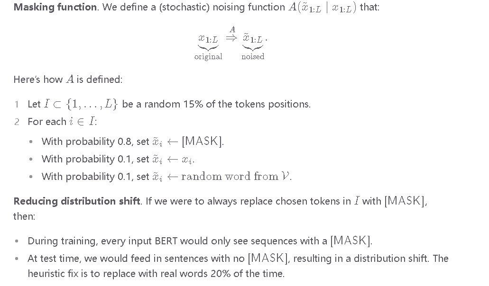

这部分内容讨论了在训练大型模型时如何处理可能遇到的数值问题（如NaN或Inf值）以及一些预防和恢复策略。以下是详细解释：

### 训练小规模模型
- **小规模模型预训练**：在训练大型模型之前，先训练小规模模型。这种方法可以及早暴露数据集和基础设施中的潜在问题。通过先解决这些问题，可以为后续大型模型的训练打下坚实基础。

### 处理NaN和Inf问题
- **跳过含NaN/Inf梯度的批次**：
  - 在每个训练批次中，如果发现梯度中存在NaN或Inf值，就跳过该批次的权重更新。这是一种防止数值问题传播的方法。
  - 参考文献提到的处理方法：Shen et al., 2019。
  - 注意：即使在跳过这些梯度更新后，NaN/Inf值仍可能在应用梯度的步骤中出现（例如，更新变量时即使现有变量或梯度没有Inf，更新后的变量仍可能导致Inf）。

- **从早期的健康检查点重启**：
  - 如果在训练过程中遇到大的波动甚至NaN/Inf值，训练过程会从一个早期的健康检查点（checkpoint）重新开始。
  - 这是为了防止数值问题的累积，并确保训练过程能够恢复到一个稳定的状态。

### 预防和恢复策略
- **重启策略**：在训练中遇到罕见的大波动或数值问题时，重启训练可以帮助恢复到健康状态。
  - 使用早期的健康检查点作为恢复点。
  - 加载新的随机批次可能有助于逃离之前失败的状态，因为批次加载的随机性可以改变训练过程中的路径，从而避免重复出现同样的问题。

### 具体步骤总结
1. **小规模模型预训练**：
   - 先训练小规模模型，检查和修复数据集和基础设施中的潜在问题。
   
2. **跳过有数值问题的批次**：
   - 在训练过程中，检测梯度中的NaN或Inf值。
   - 如果检测到这些值，跳过当前批次的权重更新，以防止数值问题传播。

3. **应用梯度更新时的数值问题**：
   - 即使前面步骤已经跳过含NaN/Inf的梯度，在实际应用梯度时仍可能遇到数值问题。
   - 在这种情况下，记录问题并准备从健康检查点重新开始训练。

4. **重启训练**：
   - 如果在训练中遇到大的波动或数值问题，立即停止训练并从早期的健康检查点重新开始。
   - 利用批次加载的随机性，尝试逃离之前失败的状态，从而避免再次遇到同样的问题。

### 结论
通过这些策略，可以更有效地管理和处理训练过程中可能遇到的数值问题（如NaN或Inf值）。这些策略确保了训练过程的稳定性和可靠性，从而提高了模型训练的成功率和效率。

---

这张图片介绍了 BERT 模型中的掩码函数（Masking function）。

我们定义了一个（随机的）噪声函数 \( A(\tilde{x}_{1:L} | x_{1:L}) \)，使得原始序列 \( x_{1:L} \) 变成了带噪声的序列 \( \tilde{x}_{1:L} \)。

函数 \( A \) 的定义如下：

1. 令 \( I \subset \{1, \ldots, L\} \) 为随机选择的 15% 的标记位置。
2. 对每个 \( i \in I \)：
   - 以 0.8 的概率，将 \( \tilde{x}_i \) 设为 \([MASK]\)。
   - 以 0.1 的概率，将 \( \tilde{x}_i \) 设为 \( x_i \)。
   - 以 0.1 的概率，将 \( \tilde{x}_i \) 设为从词汇表 \( \mathcal{V} \) 中随机选取的单词。

为了减少分布偏移（Reducing distribution shift）：

- 如果我们总是将 \( I \) 中选择的标记替换为 \([MASK]\)，则在训练期间，每个输入的 BERT 只会看到带有 \([MASK]\) 的序列。
- 在测试时，我们将会遇到没有 \([MASK]\) 的句子，这会导致分布偏移。一个启发式的修正方法是将 20% 的 \([MASK]\) 替换为真实的单词。

---

这部分内容解释了为什么在训练 BERT 模型时，不总是将被选择的标记替换为 \([MASK]\)，而是会有一定概率保留原标记或者替换为随机词。让我们详细解析一下：

### 掩码机制解释
在训练 BERT 模型时，我们对输入序列中的一部分标记进行掩码处理，以便模型能够学习预测这些掩码标记。这种掩码处理机制称为“掩码语言模型”（Masked Language Model，简称 MLM）。

假设我们有一个输入序列：
\[ x_{1:L} = [\text{I}, \text{love}, \text{reading}, \text{books}] \]

我们随机选择 15% 的标记进行掩码。假设选择了“reading”这个标记进行掩码。

### 替换策略
对于被选择进行掩码的标记，BERT 使用以下策略：
1. 以 80% 的概率，将其替换为 \([MASK]\) 标记。
2. 以 10% 的概率，保留原标记不变。
3. 以 10% 的概率，替换为词汇表 \(\mathcal{V}\) 中的随机词。

比如，对“reading”这个标记，可能出现以下情况之一：
- 以 80% 的概率，替换为 \([MASK]\)，得到序列：
  \[ [\text{I}, \text{love}, \text{[MASK]}, \text{books}] \]
- 以 10% 的概率，保留原标记“reading”，得到序列：
  \[ [\text{I}, \text{love}, \text{reading}, \text{books}] \]
- 以 10% 的概率，替换为随机词，比如“cats”，得到序列：
  \[ [\text{I}, \text{love}, \text{cats}, \text{books}] \]

### 为什么不总是用 \([MASK]\) 替换？
**分布偏移（Distribution Shift）**：
- **训练期间**：如果我们总是将被选择的标记替换为 \([MASK]\)，则模型在训练过程中会经常看到带有 \([MASK]\) 标记的序列。这会导致模型在预测时，更多依赖于 \([MASK]\) 标记的存在。
- **测试期间**：在实际应用中，输入给模型的序列通常不会包含 \([MASK]\) 标记。如果模型只在训练期间见过带有 \([MASK]\) 的序列，那么在测试期间它可能表现不佳，因为输入的分布与训练时不一致。

### 解决办法
为了解决这个问题，BERT 在训练时引入了上述的替换策略（80% \([MASK]\)，10% 原标记，10% 随机词），以便模型在不同情况下都能学习到标记的上下文信息，从而在测试期间，即使没有 \([MASK]\)，也能做出正确的预测。

### 总结
简单来说，如果总是用 \([MASK]\) 替换标记，会导致模型在训练和测试期间的数据分布不一致，从而影响模型的性能。通过引入多样化的替换策略，BERT 模型能够更好地应对测试期间的各种输入情况。

---

这张图片详细解释了 BERT 模型中的“下一句预测”（Next Sentence Prediction，简称 NSP）任务。

### 下一句预测（Next Sentence Prediction）

BERT 模型在训练时使用了成对的句子。NSP 任务的目标是预测第二个句子是否紧跟在第一个句子之后。

#### 示例
- 示例 1：
  \[
  [\text{[CLS]}, \text{the}, \text{mouse}, \text{ate}, \text{the}, \text{cheese}, [\text{SEP}], \text{it}, \text{was}, \text{full}] \Rightarrow 1
  \]
  这里第二个句子“it was full”是紧跟在第一个句子“the mouse ate the cheese”之后的，所以标签为 1。

- 示例 2：
  \[
  [\text{[CLS]}, \text{the}, \text{mouse}, \text{ate}, \text{the}, \text{cheese}, [\text{SEP}], \text{hello}, \text{world}] \Rightarrow 0
  \]
  这里第二个句子“hello world”不是紧跟在第一个句子“the mouse ate the cheese”之后的，所以标签为 0。

#### 使用 [CLS] 标记的嵌入
我们使用 [CLS] 标记的嵌入来进行二分类决策（即预测第二个句子是否紧跟在第一个句子之后）。

### 数据集构建

令 \(\mathcal{D}\) 为一组样本 \((x_{1:L}, c)\)，构建方法如下：

1. 从语料库中选取一个句子 \(A\)。
2. 以 0.5 的概率，令 \(B\) 为下一个句子。
3. 以 0.5 的概率，令 \(B\) 为语料库中随机选取的一个句子。
4. 构建序列 \(x_{1:L} = [\text{[CLS]}, A, \text{[SEP]}, B]\)。
5. 令 \(c\) 表示 \(B\) 是否为下一个句子。

### 目标函数

BERT 模型的目标函数为：
\[
\mathcal{O}(\theta) = \sum_{(x_{1:L}, c) \in \mathcal{D}} \mathbb{E}_{I \subset \{1, \ldots, L\} \sim \mathcal{A}(x_{1:L}, I)} \left[ \sum_{i \in I} -\log p_{\theta}(\tilde{x}_i | x_{1:L}) \right] + -\log p(c | \phi(x_{1:L})_1)
\]

这个目标函数包括两个部分：
1. **掩码语言模型（Masked Language Modeling）**：对被掩码的标记进行预测。
2. **下一句预测（Next Sentence Prediction）**：预测第二个句子是否为下一个句子。

### 目标函数详解
- **掩码语言模型（Masked Language Modeling）**部分：
  \[
  \mathbb{E}_{I \subset \{1, \ldots, L\} \sim \mathcal{A}(x_{1:L}, I)} \left[ \sum_{i \in I} -\log p_{\theta}(\tilde{x}_i | x_{1:L}) \right]
  \]
  这部分计算的是对掩码标记 \(\tilde{x}_i\) 的预测概率的对数损失。

- **下一句预测（Next Sentence Prediction）**部分：
  \[
  -\log p(c | \phi(x_{1:L})_1)
  \]
  这部分计算的是对第二个句子是否为下一个句子的预测概率的对数损失。

总结来说，这张图片解释了 BERT 模型的下一句预测任务的构建、数据集的构建方法以及训练目标函数的具体定义。

---

这几张图片详细介绍了 BART（Bidirectional Auto-Regressive Transformers）和 T5（Text-to-Text Transfer Transformer）模型，以及它们在处理自然语言处理任务中的应用。

### BART 模型

#### BART（Bidirectional Auto-Regressive Transformers）
- BART 是基于 Transformer 的编码器-解码器模型。
- 使用与 RoBERTa 相同的编码器架构（12 层，隐藏维度 1024）。
- 使用与 RoBERTa 相同的数据进行训练（160GB 文本）。

#### 转换操作
BART 考虑了以下几种转换操作 \( A(\tilde{x}_{1:L} | x_{1:L}) \)：
1. **Token Masking**：标记掩码
2. **Token Deletion**：标记删除
3. **Sentence Permutation**：句子排列
4. **Document Rotation**：文档旋转
5. **Text Infilling**：文本填充

基于 BERT 规模的实验，最终模型决定采用以下转换操作：
- 对文档中的 30% 的标记进行掩码。
- 对所有句子进行排列。

#### 实验结果
这些方法在分类和生成任务中都表现出了很强的效果，使用微调来实现。

### T5 模型

#### T5（Text-to-Text Transfer Transformer）
- T5 是另一个基于 Transformer 的编码器-解码器模型。

#### 任务
- 给定一段文本，随机点分割成输入和输出：
  \[
  [\text{the, mouse}] \Rightarrow [\text{ate, the, cheese}]
  \]

该论文实验了许多不同的无监督目标：
- **Prefix language modeling**：前缀语言建模
- **BERT-style**：BERT 风格
- **Deshuffling**：去混乱
- **MASS-style**：MASS 风格
- **I.i.d. noise, replace spans**：独立同分布噪声，替换跨度
- **I.i.d. noise, drop tokens**：独立同分布噪声，删除标记
- **Random spans**：随机跨度

结果发现，“i.i.d. noise, replace spans” 方法效果很好（尽管许多目标相似）。

#### 统一框架
T5 将所有经典 NLP 任务都统一为“text-to-text”任务：
- 例如，将“translate English to German: That is good.” 统一为翻译任务。

### 分类任务的不同方法
- BERT 使用 \([CLS]\) 标记的嵌入来预测。
- T5、GPT-2、GPT-3 等能够生成的模型在自然语言空间中进行分类任务。

### 研究和结果
- 论文对整个管道的许多方面（数据集、模型大小、训练目标等）进行了彻底研究。
- 基于这些见解，他们训练了一个具有 110 亿参数的模型。

总结来说，这些图片详细描述了 BART 和 T5 模型的结构、转换操作、实验结果以及它们在处理自然语言任务中的具体应用方法。这些模型在分类和生成任务中都展现了强大的性能，并为统一 NLP 任务提供了新的思路。

---

这张图片详细解释了 BERT 模型的目标函数，包含了掩码语言模型（Masked Language Modeling）和下一句预测（Next Sentence Prediction）两部分。让我们详细解释这两个损失函数，并举例说明。

### 目标函数
BERT 模型的目标函数 \(\mathcal{O}(\theta)\) 表示为：
\[
\mathcal{O}(\theta) = \sum_{(x_{1:L}, c) \in \mathcal{D}} \mathbb{E}_{I \subset \{1, \ldots, L\} \sim \mathcal{A}(x_{1:L}, I)} \left[ \sum_{i \in I} -\log p_{\theta}(\tilde{x}_i | x_{1:L}) \right] + -\log p(c | \phi(x_{1:L})_1)
\]

这个目标函数包含两个部分：
1. **掩码语言模型（Masked Language Modeling）**：对被掩码的标记进行预测。
2. **下一句预测（Next Sentence Prediction）**：预测第二个句子是否为下一个句子。

### 掩码语言模型（Masked Language Modeling）

#### 损失函数
\[
\mathbb{E}_{I \subset \{1, \ldots, L\} \sim \mathcal{A}(x_{1:L}, I)} \left[ \sum_{i \in I} -\log p_{\theta}(\tilde{x}_i | x_{1:L}) \right]
\]

这个部分计算的是对掩码标记 \(\tilde{x}_i\) 的预测概率的对数损失。

#### 举例说明
假设我们有一个句子：
\[ x_{1:L} = [\text{I}, \text{love}, \text{to}, \text{read}, \text{books}] \]

在训练时，我们随机选择一些标记进行掩码。假设选择了“read”进行掩码：
\[ \tilde{x}_{1:L} = [\text{I}, \text{love}, \text{to}, \text{[MASK]}, \text{books}] \]

模型需要预测被掩码的标记“read”。假设模型预测“read”的概率为 \(p_{\theta}(\text{read} | x_{1:L})\)，那么损失就是：
\[ -\log p_{\theta}(\text{read} | x_{1:L}) \]

### 下一句预测（Next Sentence Prediction）

#### 损失函数
\[
-\log p(c | \phi(x_{1:L})_1)
\]

这个部分计算的是对第二个句子是否为下一个句子的预测概率的对数损失。

#### 举例说明
假设我们有两个句子：
1. 句子 A：\[ \text{The weather is nice today.} \]
2. 句子 B：\[ \text{Let's go for a walk.} \]

我们将这两个句子拼接在一起：
\[ x_{1:L} = [\text{[CLS]}, \text{The weather is nice today}, \text{[SEP]}, \text{Let's go for a walk}, \text{[SEP]}] \]

我们需要预测句子 B 是否为句子 A 的下一个句子。假设这个组合的标签为 1（表示 B 是 A 的下一个句子），模型预测为：
\[ p(c = 1 | \phi(x_{1:L})_1) \]

如果模型预测这个概率为 \(p\)，那么损失就是：
\[ -\log p \]

### 总结
这两个损失函数共同作用，帮助 BERT 模型在训练过程中学习如何进行掩码标记预测和句子顺序预测。通过这种方式，BERT 能够捕捉文本中的上下文信息，并在下游任务中表现出色。

---

这几张图片详细解释了优化过程中的关键问题、ADAM 优化器及其参数更新过程，以及内存管理技术。以下是详细解释：

### 优化过程中的关键问题
1. **快速收敛**：我们希望参数 \(\theta\) 能够快速收敛到一个好的解。
2. **数值稳定性**：我们希望优化过程具有数值稳定性。
3. **内存效率**：我们希望内存使用效率高，尤其对于大模型而言。这些需求往往是相互矛盾的（例如，快速收敛和低精度内存使用会导致训练不稳定）。

### 优化的不同层次
1. **经典优化**：二阶方法、约束优化等。
2. **机器学习**：随机方法、隐式正则化和早停。
3. **深度学习**：初始化、正则化（模型架构的变化）。
4. **大型语言模型**：稳定性问题、奇怪的学习率。虽然一些直觉（例如二阶方法）仍然有用，但还有许多其他独特的挑战需要克服，以便大型语言模型的训练能够正常进行。不幸的是，许多这些方法是临时的且理解不深。

### ADAM（自适应矩估计）
ADAM 结合了两个思想：
- 使用动量（保持在同一方向上移动）。
- 对 \(\theta\) 的每个维度使用自适应的（不同的）步长（从二阶方法中获得灵感）。

#### ADAM 的步骤
1. 初始化参数 \(\theta_0\)。
2. 初始化动量 \(m_0, v_0 \leftarrow 0\)。
3. 重复以下步骤：
   - 采样一个 mini-batch \(B_t \subset \mathcal{D}\)。
   - 更新参数如下：

#### 参数更新过程
1. 计算梯度：
   \[
   g_t \leftarrow \frac{1}{|B_t|} \sum_{x_{1:L} \in B_t} \nabla_{\theta}(-\log p_{\theta}(x_{1:L}))
   \]

2. 更新一阶和二阶动量：
   \[
   m_t \leftarrow \beta_1 m_{t-1} + (1 - \beta_1) g_t
   \]
   \[
   v_t \leftarrow \beta_2 v_{t-1} + (1 - \beta_2) g_t^2
   \]

3. 进行偏差校正：
   \[
   \hat{m}_t \leftarrow m_t / (1 - \beta_1^t)
   \]
   \[
   \hat{v}_t \leftarrow v_t / (1 - \beta_2^t)
   \]

4. 更新参数：
   \[
   \theta_t \leftarrow \theta_{t-1} - \eta \hat{m}_t / (\sqrt{\hat{v}_t} + \epsilon)
   \]

### 内存管理
使用 ADAM 增加了从 \(2 \times \text{num-params}\)（从 \(\theta_t, g_t\)）到 \(4 \times \text{num-params}\)（从 \(\theta_t, g_t, m_t, v_t\)）的存储量。

#### AdaFactor
AdaFactor 被提出作为一种减少内存占用的方法。
- 不存储 \((m_t, v_t)\) 的矩阵，而是存储行和列的总和。
- 移除动量。
- 用于训练 T5 模型。
- 训练 AdaFactor 可能比较困难。

#### 混合精度训练
- 默认：FP32（32 位浮点）。
- 选项：FP16（16 位浮点），但问题是任何小于 \(2^{-24}\) 的值变为 0。
- 解决方案：存储主权重为 FP32，其余为 FP16。
- 损失缩放：放大损失以避免梯度值太小。
- 结果：减少一半的内存使用。

这些内容详细描述了优化过程中需要考虑的因素和方法，以及如何通过 ADAM 和内存管理技术来提升大型模型的训练效率和稳定性。   

---

这两张图片详细解释了混合精度训练、学习率、初始化方法以及 GPT-3 的训练参数。以下是详细解释：

### 混合精度训练
图示展示了混合精度训练的流程：
- 使用 `float2half` 将浮点数转换为半精度（FP16）。
- 主权重（Master-Weights）存储为 32 位浮点（FP32）。
- 前向传播（FWD）、反向传播的激活（BWD-Actv）和反向传播的权重（BWD-Weight）都在 FP16 下进行。
- 更新权重时，使用 FP32 的主权重进行更新。

### 学习率
- 通常情况下，学习率会随着时间的推移而减少。
- 对于 Transformers 模型，我们实际上需要增加学习率（称为 warmup）。
- Huang 等人（2020）显示，这样做的潜在原因是防止梯度消失（vanishing gradients），从而导致 Adam 优化器的不稳定。

### 初始化方法
- 给定一个矩阵 \(W \in \mathbb{R}^{m \times n}\)，标准初始化方法（Xavier 初始化）是 \(W_{ij} \sim \mathcal{N}(0, 1/n)\)，其中 \(n\) 是输入单元数。
- GPT-2 和 GPT-3 通过额外的 \(1/\sqrt{N}\) 来缩放权重，这里 \(N\) 是残差层的数量。
- T5 通过额外的 \(1/\sqrt{d}\) 来缩放注意力矩阵。

### GPT-3 的训练参数
- **Adam 参数**：\(\beta_1 = 0.9\)，\(\beta_2 = 0.95\)，\(\epsilon = 10^{-8}\)。
- **批次大小**：320 万个标记（约 1500 个序列）。
- **使用梯度剪裁**：\(g_t \leftarrow g_t / \min(1, \|g_t\|)\)。
- **线性学习率预热**：在前 3.75 亿个标记中进行线性学习率预热。
- **余弦学习率**：余弦学习率下降，降至初始值的 10%。
- **逐步增加批次大小**。
- **权重衰减**：0.1。

这些内容详细描述了混合精度训练的步骤和优点，以及针对不同模型的初始化方法和学习率策略。GPT-3 的训练参数和优化策略也进一步说明了如何处理大型语言模型的训练挑战。

这几段文字描述了在训练大型模型（如 GPT-3）时，优化训练过程的几种重要技术。下面是对每种技术的详细解释：

### 1. 使用梯度剪裁（Gradient Clipping）

梯度剪裁是一种防止梯度爆炸的技术。梯度爆炸是指在反向传播过程中，梯度值变得非常大，导致参数更新过大，使模型无法收敛。梯度剪裁通过限制梯度的最大范数来避免这一问题。

具体实现方法：
\[ g_t \leftarrow \frac{g_t}{\max(1, \|g_t\|)} \]

解释：
- 首先计算梯度 \(g_t\) 的范数（即梯度的大小）。
- 如果梯度范数小于 1，则保持梯度不变。
- 如果梯度范数大于 1，则将梯度缩放，使其范数为 1。

这样可以确保梯度不会过大，从而使模型的参数更新稳定，有助于训练过程的稳定性。

### 2. 线性学习率预热（Linear Learning Rate Warmup）

在训练开始时，学习率从较小的值开始，然后逐渐增加到目标学习率。线性学习率预热的好处在于，可以防止在训练初期由于较大的学习率导致的训练不稳定或模型发散。

具体实现方法：
- 在训练的初始阶段（例如前 3.75 亿个标记），学习率从一个小值线性增加到预定的目标学习率。

这可以帮助模型在训练初期稳定地找到一个好的优化方向，从而提高后续训练的效率和效果。

### 3. 余弦学习率衰减（Cosine Learning Rate Decay）

在训练过程中，学习率通常需要逐渐减小，以便模型在接近最优解时能够进行更细致的搜索。余弦学习率衰减是一种有效的学习率下降策略。

具体实现方法：
- 学习率按照余弦曲线从初始值逐渐减小到初始值的 10%。

\[ \eta_t = \eta_{\text{min}} + \frac{1}{2} (\eta_{\text{max}} - \eta_{\text{min}}) \left(1 + \cos\left(\frac{t}{T} \pi\right)\right) \]

解释：
- \(\eta_t\) 是第 \(t\) 次迭代的学习率。
- \(\eta_{\text{max}}\) 是学习率的初始值。
- \(\eta_{\text{min}}\) 是学习率的最小值。
- \(T\) 是总的训练次数。

这种方式使得学习率在训练初期较大，有助于快速收敛，然后逐渐减小，帮助模型更精细地调整参数。

### 4. 逐步增加批次大小（Gradually Increasing Batch Size）

逐步增加批次大小是一种优化训练过程的方法，可以在保持较高训练效率的同时提高模型的泛化能力。

具体实现方法：
- 在训练过程中，逐渐增加每个训练批次（batch）的大小。

解释：
- 在训练初期使用较小的批次大小，有助于模型快速学习数据的总体趋势。
- 随着训练的进行，逐渐增加批次大小，可以减少参数更新的方差，提高模型的稳定性和泛化能力。

这种方法结合了小批次训练的快速收敛和大批次训练的稳定性，有助于在大规模数据集上训练大型模型。

### 结合使用这些技术

在训练像 GPT-3 这样的大型模型时，结合使用这些优化技术可以显著提高训练效率和模型性能。具体的步骤和参数设置可能会根据实际情况进行调整，但核心思想是通过控制梯度、学习率和批次大小，使得训练过程更加稳定和高效。

---

梯度爆炸和梯度消失这两个现象并不矛盾，它们可以在同一个深层神经网络中不同的条件下发生。理解它们的机制和原因有助于在实际应用中采取合适的应对策略。

### 梯度爆炸（Gradient Exploding）

#### 现象
梯度爆炸是指在反向传播过程中，梯度的值变得非常大，导致参数更新过大，使模型训练不稳定甚至发散。

#### 主要原因
- **深度网络中的累积误差**：在反向传播过程中，误差的梯度在每一层中不断累积，如果这些梯度的增大效应大于减小效应，最终梯度会变得非常大。
- **权重初始化不当**：初始权重过大，导致前向传播时激活值过大，从而使得反向传播时梯度值也非常大。

#### 解决方法
1. **梯度剪裁**：限制梯度的最大值。
2. **合适的权重初始化**：如 Xavier 初始化或 He 初始化。
3. **降低学习率**：减小每一步的参数更新幅度。
4. **正则化**：如 L2 正则化限制权重的增长。

### 梯度消失（Gradient Vanishing）

#### 现象
梯度消失是指在反向传播过程中，梯度的值变得非常小，导致参数几乎不更新，使得训练过程停滞。

#### 主要原因
- **激活函数的性质**：如 sigmoid 和 tanh 激活函数在输入很大或很小时，梯度趋近于零。
- **深度网络中的累积误差**：在深层网络中，梯度在每一层中不断累积，如果这些梯度的减小效应大于增大效应，最终梯度会变得非常小。

#### 解决方法
1. **使用适当的激活函数**：如 ReLU 和其变体（Leaky ReLU、ELU）。
2. **Batch Normalization**：对每一层的输入进行标准化处理。
3. **合适的权重初始化**：如 Xavier 初始化或 He 初始化。
4. **使用残差网络（ResNet）**：通过跳跃连接帮助梯度在层间直接传播。
5. **使用 LSTM 或 GRU**：在循环神经网络中使用这些结构以减小梯度消失的问题。

### 梯度爆炸与梯度消失的关系

梯度爆炸和梯度消失这两个现象并不矛盾，它们可能在同一个网络中不同的条件下分别发生。例如：
- 在深层神经网络的某些层中，由于累积效应，梯度可能变得非常大，导致梯度爆炸。
- 同时，在网络的其他层中，尤其是靠近输入层的地方，梯度可能逐渐变小，导致梯度消失。

### 举例说明

假设我们有一个非常深的神经网络，在进行反向传播时：
- 在靠近输出层的地方，梯度可能会快速增加，导致梯度爆炸。
- 在靠近输入层的地方，梯度可能会快速减小，导致梯度消失。

这种情况下，我们需要采取不同的策略来分别解决梯度爆炸和梯度消失的问题。梯度剪裁和适当的权重初始化可以帮助控制梯度爆炸，而使用合适的激活函数和 Batch Normalization 则可以帮助缓解梯度消失。

### 总结

梯度爆炸和梯度消失是深层神经网络训练中的两种常见问题，它们可以同时存在但不矛盾。理解它们的机制和原因，有助于在实际应用中采取合适的策略来应对这些问题，从而确保神经网络的有效训练。

----

梯度爆炸（Gradient Exploding）和梯度消失（Gradient Vanishing）是神经网络训练中的两个常见问题。它们通常出现在深层神经网络或循环神经网络（RNN）中。以下是对这两个问题及其解决方法的详细解释：

### 梯度爆炸（Gradient Exploding）

#### 现象
梯度爆炸是指在反向传播过程中，梯度的值变得非常大，导致模型参数更新过大，训练过程变得不稳定甚至发散。

#### 原因
梯度爆炸通常发生在深层神经网络中，当网络层数很多时，误差的梯度在反向传播过程中不断累积和相乘，导致梯度指数级增长。尤其在激活函数的导数值较大时（如使用ReLU时），更容易发生梯度爆炸。

#### 解决方法
1. **梯度剪裁（Gradient Clipping）**：
   - 将梯度的值限制在一个预设的范围内。例如，将梯度的范数限制在某个最大值 \( \tau \)：
     \[
     g_t \leftarrow \frac{g_t}{\max(1, \|g_t\| / \tau)}
     \]
   - 这种方法可以有效防止梯度值过大。

2. **使用较小的学习率**：
   - 减小学习率可以减小每一步的参数更新幅度，从而减小梯度爆炸的风险。

3. **正则化**：
   - L2 正则化（权重衰减）可以在一定程度上限制权重的增长，防止梯度爆炸。

4. **合适的权重初始化**：
   - 使用如 Xavier 初始化或 He 初始化，可以使权重初始值在一个合理的范围内，从而减小梯度爆炸的可能性。

### 梯度消失（Gradient Vanishing）

#### 现象
梯度消失是指在反向传播过程中，梯度的值变得非常小，导致模型参数几乎不更新，使训练过程停滞不前。

#### 原因
梯度消失通常发生在深层神经网络中，当网络层数很多时，误差的梯度在反向传播过程中不断累积和相乘，导致梯度值指数级减小。尤其在激活函数的导数值较小时（如使用 sigmoid 或 tanh 时），更容易发生梯度消失。

#### 解决方法
1. **使用合适的激活函数**：
   - ReLU 和其变体（如 Leaky ReLU、ELU 等）在一定程度上可以缓解梯度消失问题，因为它们的导数不小于 0。
   
2. **Batch Normalization**：
   - 对每一层的输入进行标准化处理，可以使数据分布更加稳定，从而减小梯度消失的风险。
   
3. **权重初始化**：
   - 使用如 Xavier 初始化或 He 初始化，可以使权重初始值在一个合理的范围内，减小梯度消失的可能性。

4. **使用残差网络（ResNet）**：
   - 通过引入跳跃连接（skip connections），使得梯度可以在层间直接传播，减小梯度消失的问题。

5. **LSTM 和 GRU**：
   - 在循环神经网络中，使用 LSTM（长短期记忆网络）或 GRU（门控循环单元）结构，这些结构通过设计特殊的门控机制，帮助梯度在长时间步内进行传播，减小梯度消失的问题。

### 总结
- **梯度爆炸**：主要通过梯度剪裁、降低学习率、正则化和合适的权重初始化来解决。
- **梯度消失**：主要通过使用合适的激活函数、Batch Normalization、权重初始化、残差网络和 LSTM/GRU 来解决。

这两个问题在深度学习的训练过程中都非常关键，合适的解决方法可以显著提高训练的效果和效率。